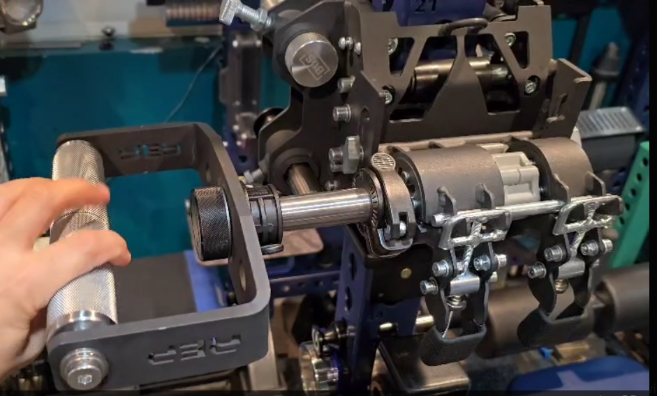

Custom DIY cable attachment handles for home gym setups.

## Table of Contents

- [Tranman Open D Handles](#tranman-open-d-handles)
- [Tranman Closed D Handles](#tranman-closed-d-handles)
- [Forza Handles (mech6)](#forza-handles-mech6)
- [Trak Kaz Knurled Handle (sinix)](#trak-kaz-knurled-handle-sinix)
- [VTS Custom Rotating Handles (spohc)](#vts-custom-rotating-handles-spohc)
- [Rogue V-Bar Wide 120° Bracket (jv)](#rogue-v-bar-wide-120-bracket-jv)

---

## Tranman Open D Handles

### 📁 Files

- [Open Handle CAD file](tranman/Angled%20Open%20D%20Handle.step)

### 🔧 Materials & Specifications

- **Material:** 304 Stainless Steel (6.3MM)
- **Optional:** Add M10 1.5 tap for swivel hook compatibility (see image below)

### 🛒 Parts & Supplies

#### Swivel Hook

- Swivel Option [Adjustable Dumbbell Swivel Eye Hooks](https://eggweights.com/products/adjustable-dumbbell-swivel-eye-hooks) from Egg Weights
- Static eye bolt: [eye bolt](https://www.amazon.com/dp/B0CP3SBC9Q?th=1) + [bolt](https://www.amazon.com/dp/B0CN6KDBYK?ref=ppx_yo2ov_dt_b_fed_asin_title&th=1)

#### Hex Nut

- Any M10 1.5 hex nut (available on Amazon)

#### Handles

Choose from Rogue Fitness (Aluminum recommended for lighter weight):

- [Rogue H5 Multi-Grip Handles](https://www.roguefitness.com/rogue-h-5-multi-grip-and-cable-attachment-handles) (Aluminum or Stainless)
- [Rogue MG-4CN Narrow Multi-Grip Handles](https://www.roguefitness.com/rogue-mg-4cn-narrow-multi-grip-camber-bar) (Stainless)

---

## Tranman Closed D Handles

### 📁 Files

- [Closed Handle CAD file](tranman/scs%20d%20handle.step)

### 🛒 Parts & Supplies

- SCS should have two 90 degree bends:
- 

#### Attachment Hook

- Swivel Option [Adjustable Dumbbell Swivel Eye Hooks](https://eggweights.com/products/adjustable-dumbbell-swivel-eye-hooks) from Egg Weights
- Static eye bolt: [eye bolt](https://www.amazon.com/dp/B0CP3SBC9Q?th=1) + [bolt](https://www.amazon.com/dp/B0CN6KDBYK?ref=ppx_yo2ov_dt_b_fed_asin_title&th=1)

#### Handles

Choose from Rogue Fitness (Aluminum recommended for lighter weight):

- [Rogue H5 Multi-Grip Handles](https://www.roguefitness.com/rogue-h-5-multi-grip-and-cable-attachment-handles) (Aluminum or Stainless)
- [Rogue MG-4CN Narrow Multi-Grip Handles](https://www.roguefitness.com/rogue-mg-4cn-narrow-multi-grip-camber-bar) (Stainless)

---

## Custom Grommets for Gymnastics Forza Iron Cross Handles (mech6)

Custom 3D printed grommets to protect the aluminum attachment holes on your [gymnastics forza iron cross handles](https://store.gymnasticsforza.com/products/gymnastics-forza-iron-cross-system).  One smaller version provides coverage for one attachment hole on the handle, the other provides coverage for all attachment holes (excluding the holes that are covered by the bolts that hold the grommets in place).

### 📁 Files

- [Larger STEP](mech6/larger-forza-version.STEP)
- [Smaller STEP](mech6/smaller-forza-version.STEP)

### 🔧 Specifications

- Designed for 3D printing; confirm exact thickness from the STEP before ordering/printing
- You may update the size holes in the STEP files to match your preferred swivel hooks or carabiners
- Recommend using PETG for 3D printing, **Need 4 total printed, two each handle** (print 4 of the larger STEP *OR* 4 of the smaller STEP file)

### 📝 Notes

- Two STEP files are available, depending on whether you plan to utilize/protect one or all attachment holes
- 
  - https://www.mcmaster.com/catalog/131/3736/93441A441
  - https://www.mcmaster.com/products/98002a301/
  - https://www.mcmaster.com/products/3583t11/

---

## Trak Kaz Knurled Handle (sinix)

Knurled handles designed for cable machine attachments with ergonomic grip. Would recommend printing in TPU to keep the rubber feel, however PETG/PLA will work too.

### 📁 Files

- [Trak Kaz Handles](sinix/Trak-Kaz-handles.stl)

## VTS Custom Rotating Handles (spohc)

### 📁 Files

- No special files needed as these are built with off-the-shelf parts.

### 📝 Description

These custom rotating handles are built using parts from Rep Fitness Open Trap Bar handles and other standard gym hardware. The concept relies on the fact that many knurled handles (Rorman Strength Megalith, Rep Fitness Open Trap Bar, WM Fabs Mo Row, Giant Lifting) use the same M10-1.5 bolt size and thread pitch.

### 🛒 Parts & Supplies

#### Handles & Brackets

- [Rep Fitness Open Trap Bar Handles](https://repfitness.com/products/open-trap-bar-handles?variant=42225145643166)
  - *Note:* Be careful when removing the bolts as they can strip easily. This set provides 3 pairs of handles to tinker with. The center bracket is the key component.

#### Mounting Hardware

- **Band Pegs:** 1" band peg required.
  - [Rogue Monster Band Pegs 2.0](https://www.roguefitness.com/monster-band-pegs-2-0-4-pack) (Recommended for flush fit)
  - Oak Club band pegs also work.
  - *Alternative:* [Amazon Band Pegs](https://a.co/d/iRFunIt) (Check dimensions)
- **Collars:** Standard size weight collar to fasten the bracket.
  - [Example Collar](https://a.co/d/ddiLgF9)
- **Rotation:** Needle bearing washers are needed if you want the handles to rotate smoothly.
  - [Needle Bearing Washers](https://a.co/d/1qIFRCS)

### 💡 Tips

- You can save money by buying one of the other trap bar handle variants if you don't need the thick grips.
- Fringe Sport used to sell cheaper band pegs, but availability varies.
- A long enough bolt or rod could also work in place of a band peg.

---

## Rogue V-Bar Wide 120° Bracket (jv)

Replacement bracket for the [Rogue Rotating V-Grip Cable Attachment](https://www.roguefitness.com/rogue-rotating-v-grip-cable-attachment) that moves the handles out wider and flattens the handle angle to 120° (from the stock 90°).

### 📁 Files

- [Bracket STEP file](jv/rogue_v_bar_wide_120_deg_bracket/rogue_vbar_wide_120_bracket.step)

### 🔧 Materials & Specifications

- **Material:** 0.313" (5/16") Steel
- **Fabrication:** [Oshcut](https://www.oshcut.com) — the STEP file's bend radius and k-factor match the [Oshcut material catalog](https://app.oshcut.com/catalog/sheet) specs for 0.313" A36 / A1011 HR steel
- **Alternative:** Can be made in 1/4" steel via [SendCutSend](https://www.sendcutsend.com), but the bend radius and k-factor will not match their material specs and will be auto-adjusted
- **Hardware:** 3/8" washer required to ensure full contact with the center bracket. If using 1/4" steel, the washer must be > 1/16" thick

### 🛒 Parts & Supplies

- [Rogue Rotating V-Grip Cable Attachment](https://www.roguefitness.com/rogue-rotating-v-grip-cable-attachment) (donor attachment — bracket replaces the stock V bracket)
- 2 x 5/16" steel bracket (from STEP)
- 2 x [3/8" Washer](https://www.mcmaster.com/98026A113/) (example from McMaster-Carr)
