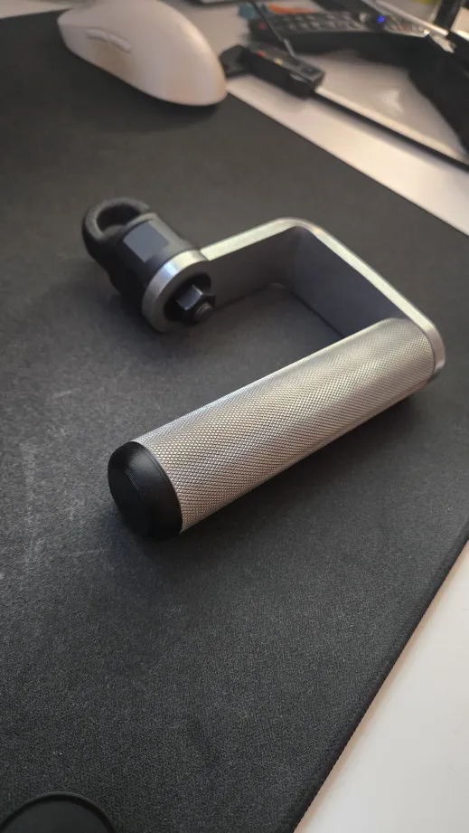
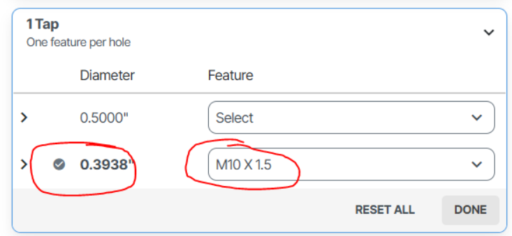
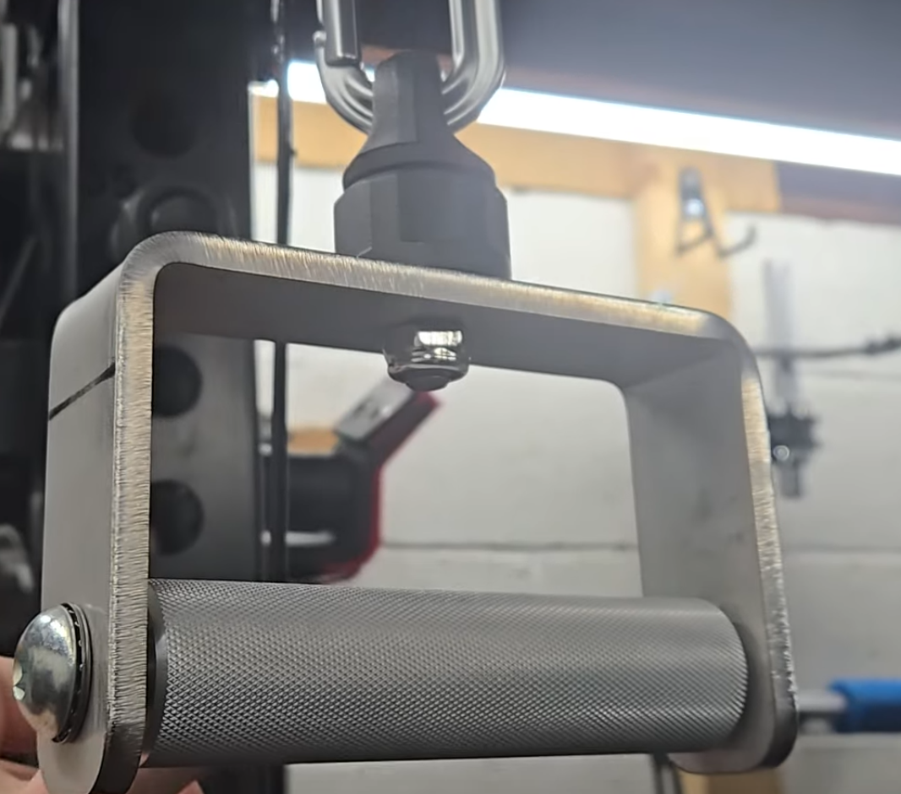
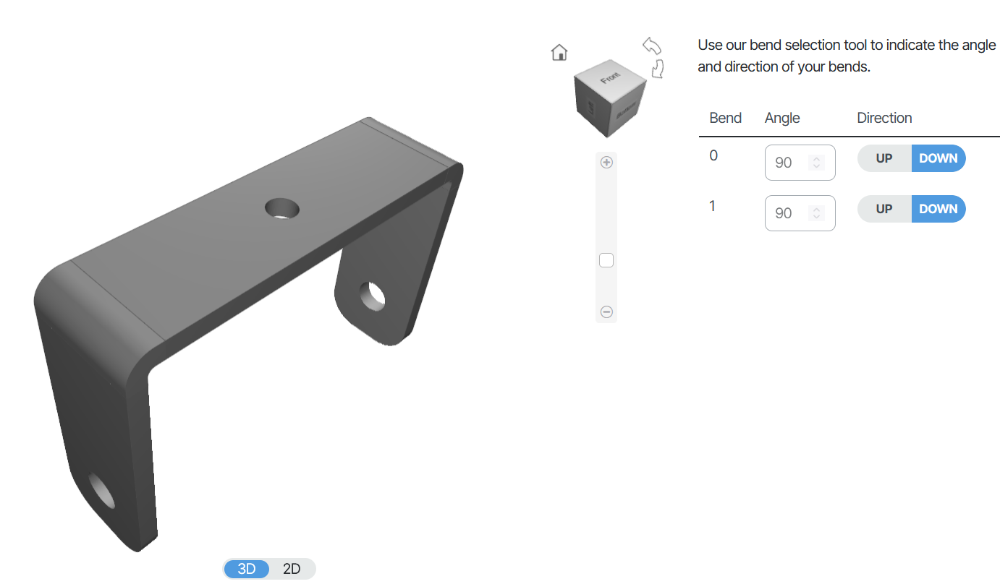
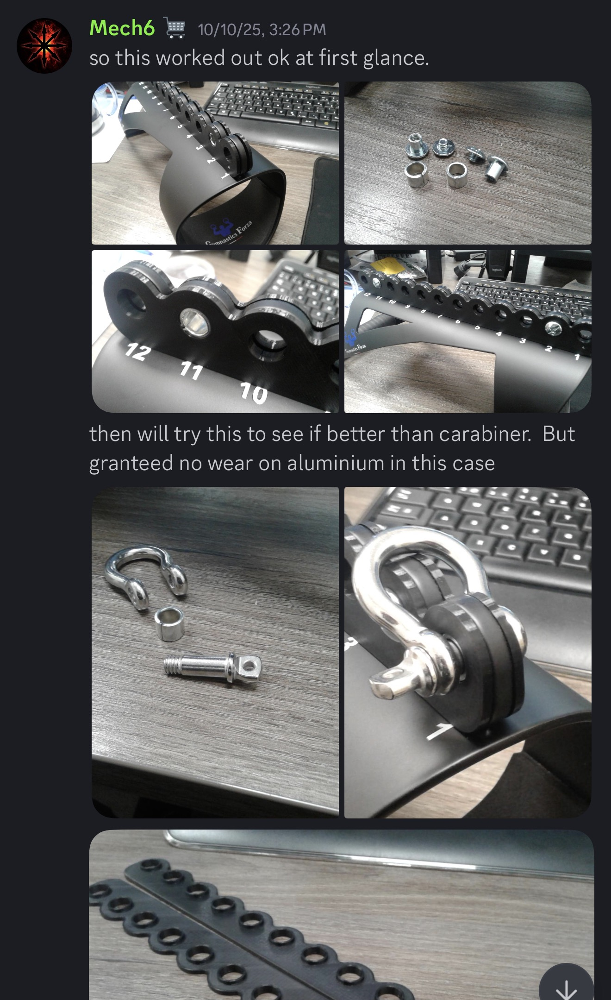
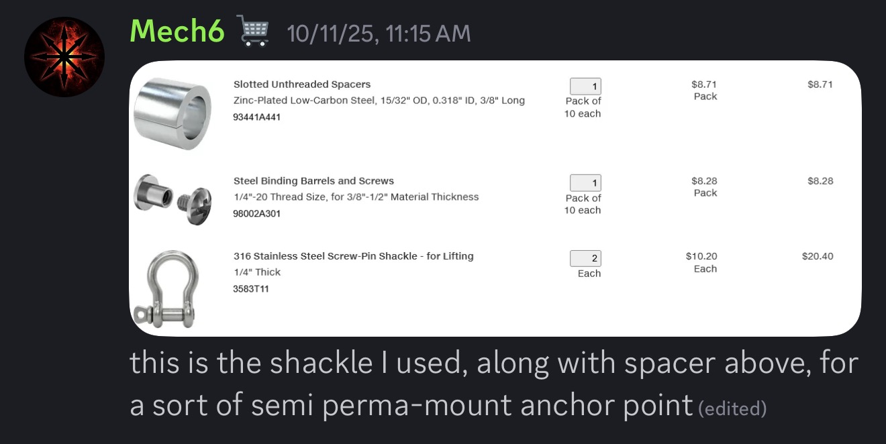

Custom DIY cable attachment handles for home gym setups.

## Table of Contents

- [Tranman Open D Handles](#tranman-open-d-handles)
- [Tranman Closed D Handles](#tranman-closed-d-handles)
- [Forza Handles (mech6)](#forza-handles-mech6)

---

## Tranman Open D Handles

### 📁 Files

- [Open Handle CAD file](tranman/scs%20d%20handle.step)
- [Handle Screw Cover: 28.5](tranman/Screw%20Cover%20-%2028.5MM.3mf)
- [Handle Screw Cover: 32](tranman/D%20Handle%20Screw%20Cover%20(32MM).3mf)

### 🔧 Materials & Specifications

- **Material:** 304 Stainless Steel (6.3MM)
- **Optional:** Add M10 1.5 tap for swivel hook compatibility (see image below)

### 🛒 Parts & Supplies

#### Swivel Hook

- Swivel Option [Adjustable Dumbbell Swivel Eye Hooks](https://eggweights.com/products/adjustable-dumbbell-swivel-eye-hooks) from Egg Weights
- Static eye bolt: [eye bolt](https://www.amazon.com/dp/B0CP3SBC9Q?th=1) + [bolt](https://www.amazon.com/dp/B0CN6KDBYK?ref=ppx_yo2ov_dt_b_fed_asin_title&th=1)

#### Hex Nut

- Any M10 1.5 hex nut (available on Amazon)

#### Handles

Choose from Rogue Fitness (Aluminum recommended for lighter weight):

- [Rogue H5 Multi-Grip Handles](https://www.roguefitness.com/rogue-h-5-multi-grip-and-cable-attachment-handles) (Aluminum or Stainless)
- [Rogue MG-4CN Narrow Multi-Grip Handles](https://www.roguefitness.com/rogue-mg-4cn-narrow-multi-grip-camber-bar) (Stainless)

---

## Tranman Closed D Handles

### 📁 Files

- [Closed Handle CAD file](tranman/scs%20d%20handle.step)

### 🛒 Parts & Supplies

- SCS should have two 90 degree bends:
- 

#### Attachment Hook

- Swivel Option [Adjustable Dumbbell Swivel Eye Hooks](https://eggweights.com/products/adjustable-dumbbell-swivel-eye-hooks) from Egg Weights
- Static eye bolt: [eye bolt](https://www.amazon.com/dp/B0CP3SBC9Q?th=1) + [bolt](https://www.amazon.com/dp/B0CN6KDBYK?ref=ppx_yo2ov_dt_b_fed_asin_title&th=1)

#### Handles

Choose from Rogue Fitness (Aluminum recommended for lighter weight):

- [Rogue H5 Multi-Grip Handles](https://www.roguefitness.com/rogue-h-5-multi-grip-and-cable-attachment-handles) (Aluminum or Stainless)
- [Rogue MG-4CN Narrow Multi-Grip Handles](https://www.roguefitness.com/rogue-mg-4cn-narrow-multi-grip-camber-bar) (Stainless)

---

## Forza Handles (mech6)
Pair of ergonomic multi-grip handles sized for custom cable machines. Includes separate STEP files for each side.

### 📁 Files

- [Larger STEP](mech6/larger-forza-version.STEP)
- [Smaller STEP](mech6/smaller-forza-version.STEP)

### 🔧 Specifications

- Designed for laser cutting from 0.187"–0.250" steel or stainless; confirm exact thickness from the STEP before ordering
- Add tumble/deburr plus powder coat or Cerakote for grip comfort
- Tapping/hardware requirements are called out in the CAD; size holes to match your preferred swivel hooks or carabiners
- Recommend using PETG for 3D printing, **Need 4 total printed, two each handle**

### 📝 Notes

- Two STEP files mirror each other so you can build left/right handles
- Consider pairing with Prime-style rubber grips or powder-coated steel tubes for the palm surface
- If cutting through SendCutSend, include bend/tap services only if you update the STEP to match their specs; current files are flat patterns
- 
  - https://www.mcmaster.com/catalog/131/3736/93441A441
  - https://www.mcmaster.com/products/98002a301/
  - https://www.mcmaster.com/products/3583t11/

