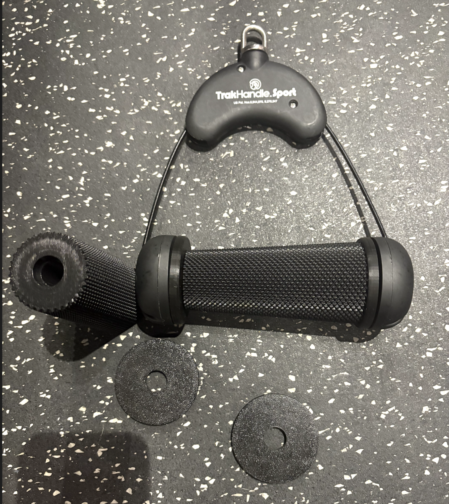

Custom DIY cable attachment handles for home gym setups.

## Table of Contents

- [Tranman Open D Handles](#tranman-open-d-handles)
- [Tranman Closed D Handles](#tranman-closed-d-handles)
- [Forza Handles (mech6)](#forza-handles-mech6)
- [Trak Kaz Knurled Handle (sinix)](#trak-kaz-knurled-handle-sinix)

---

## Tranman Open D Handles

### 📁 Files

- [Open Handle CAD file](tranman/Angled%20Open%20D%20Handle.step)

### 🔧 Materials & Specifications

- **Material:** 304 Stainless Steel (6.3MM)
- **Optional:** Add M10 1.5 tap for swivel hook compatibility (see image below)

### 🛒 Parts & Supplies

#### Swivel Hook

- Swivel Option [Adjustable Dumbbell Swivel Eye Hooks](https://eggweights.com/products/adjustable-dumbbell-swivel-eye-hooks) from Egg Weights
- Static eye bolt: [eye bolt](https://www.amazon.com/dp/B0CP3SBC9Q?th=1) + [bolt](https://www.amazon.com/dp/B0CN6KDBYK?ref=ppx_yo2ov_dt_b_fed_asin_title&th=1)

#### Hex Nut

- Any M10 1.5 hex nut (available on Amazon)

#### Handles

Choose from Rogue Fitness (Aluminum recommended for lighter weight):

- [Rogue H5 Multi-Grip Handles](https://www.roguefitness.com/rogue-h-5-multi-grip-and-cable-attachment-handles) (Aluminum or Stainless)
- [Rogue MG-4CN Narrow Multi-Grip Handles](https://www.roguefitness.com/rogue-mg-4cn-narrow-multi-grip-camber-bar) (Stainless)

---

## Tranman Closed D Handles

### 📁 Files

- [Closed Handle CAD file](tranman/scs%20d%20handle.step)

### 🛒 Parts & Supplies

- SCS should have two 90 degree bends:
- 

#### Attachment Hook

- Swivel Option [Adjustable Dumbbell Swivel Eye Hooks](https://eggweights.com/products/adjustable-dumbbell-swivel-eye-hooks) from Egg Weights
- Static eye bolt: [eye bolt](https://www.amazon.com/dp/B0CP3SBC9Q?th=1) + [bolt](https://www.amazon.com/dp/B0CN6KDBYK?ref=ppx_yo2ov_dt_b_fed_asin_title&th=1)

#### Handles

Choose from Rogue Fitness (Aluminum recommended for lighter weight):

- [Rogue H5 Multi-Grip Handles](https://www.roguefitness.com/rogue-h-5-multi-grip-and-cable-attachment-handles) (Aluminum or Stainless)
- [Rogue MG-4CN Narrow Multi-Grip Handles](https://www.roguefitness.com/rogue-mg-4cn-narrow-multi-grip-camber-bar) (Stainless)

---

## Custom Grommets for Gymnastics Forza Iron Cross Handles (mech6)

Custom 3D printed grommets to protect the aluminum attachment holes on your [gymnastics forza iron cross handles](https://store.gymnasticsforza.com/products/gymnastics-forza-iron-cross-system).  One smaller version provides coverage for one attachment hole on the handle, the other provides coverage for all attachment holes (excluding the holes that are covered by the bolts that hold the grommets in place).  

### 📁 Files

- [Larger STEP](mech6/larger-forza-version.STEP)
- [Smaller STEP](mech6/smaller-forza-version.STEP)

### 🔧 Specifications

- Designed for 3D printing; confirm exact thickness from the STEP before ordering/printing
- You may update the size holes in the STEP files to match your preferred swivel hooks or carabiners
- Recommend using PETG for 3D printing, **Need 4 total printed, two each handle** (print 4 of the larger STEP *OR* 4 of the smaller STEP file)

### 📝 Notes

- Two STEP files are available, depending on whether you plan to utilize/protect one or all attachment holes
- 
  - https://www.mcmaster.com/catalog/131/3736/93441A441
  - https://www.mcmaster.com/products/98002a301/
  - https://www.mcmaster.com/products/3583t11/

---

## Trak Kaz Knurled Handle (sinix)

Knurled handles designed for cable machine attachments with ergonomic grip. Would recommend printing in TPU to keep the rubber feel, however PETG/PLA will work too.

### 📁 Files

- [Trak Kaz Handles](sinix/Trak-Kaz-handles.stl)
