Custom DIY cable attachment handles for home gym setups.

## Table of Contents

- [Tranman Open D Handles](#tranman-open-d-handles)
- [Tranman Closed D Handles](#tranman-closed-d-handles)
- [Tranman Angled Supported Curl Bracket](#tranman-angled-supported-curl-bracket)
- [Tranman Hammer Supported Curl Bracket](#tranman-hammer-supported-curl-bracket)
- [Forza Handles (mech6)](#forza-handles-mech6)
- [Trak Kaz Knurled Handle (sinix)](#trak-kaz-knurled-handle-sinix)
- [VTS Custom Rotating Handles (spohc)](#vts-custom-rotating-handles-spohc)
- [Rogue V-Bar Wide 120° Bracket (jv)](#rogue-v-bar-wide-120-bracket-jv)

---

## Tranman Open D Handles

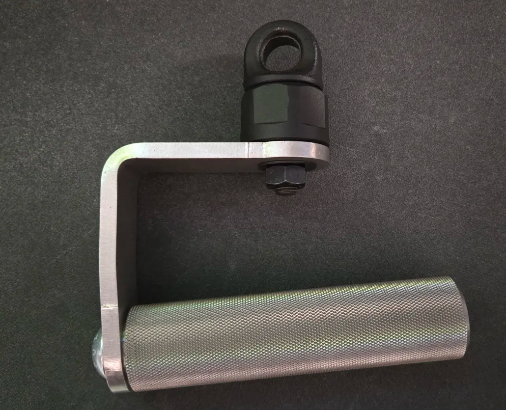
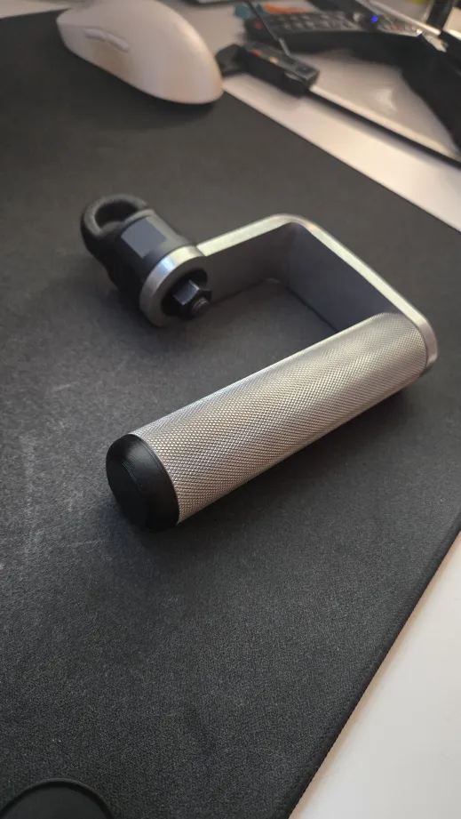

### 📁 Files

- [Open Handle CAD file](tranman/angled-open-d-handle.step)

### 🔧 Materials & Specifications

- **Material:** 304 Stainless Steel (6.3MM)
- **Optional:** Add M10 1.5 tap for swivel hook compatibility (see image below)

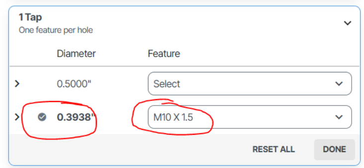

### 🛒 Parts & Supplies

#### Swivel Hook

- Swivel Option [Adjustable Dumbbell Swivel Eye Hooks](https://eggweights.com/products/adjustable-dumbbell-swivel-eye-hooks) from Egg Weights
- Static eye bolt: [eye bolt](https://www.amazon.com/dp/B0CP3SBC9Q?th=1) + [bolt](https://www.amazon.com/dp/B0CN6KDBYK?ref=ppx_yo2ov_dt_b_fed_asin_title&th=1)

#### Hex Nut

- Any M10 1.5 hex nut (available on Amazon)

#### Handles

Choose from Rogue Fitness (Aluminum recommended for lighter weight):

- [Rogue H5 Multi-Grip Handles](https://www.roguefitness.com/rogue-h-5-multi-grip-and-cable-attachment-handles) (Aluminum or Stainless)
- [Rogue MG-4CN Narrow Multi-Grip Handles](https://www.roguefitness.com/rogue-mg-4cn-narrow-multi-grip-camber-bar) (Stainless)

---

## Tranman Closed D Handles

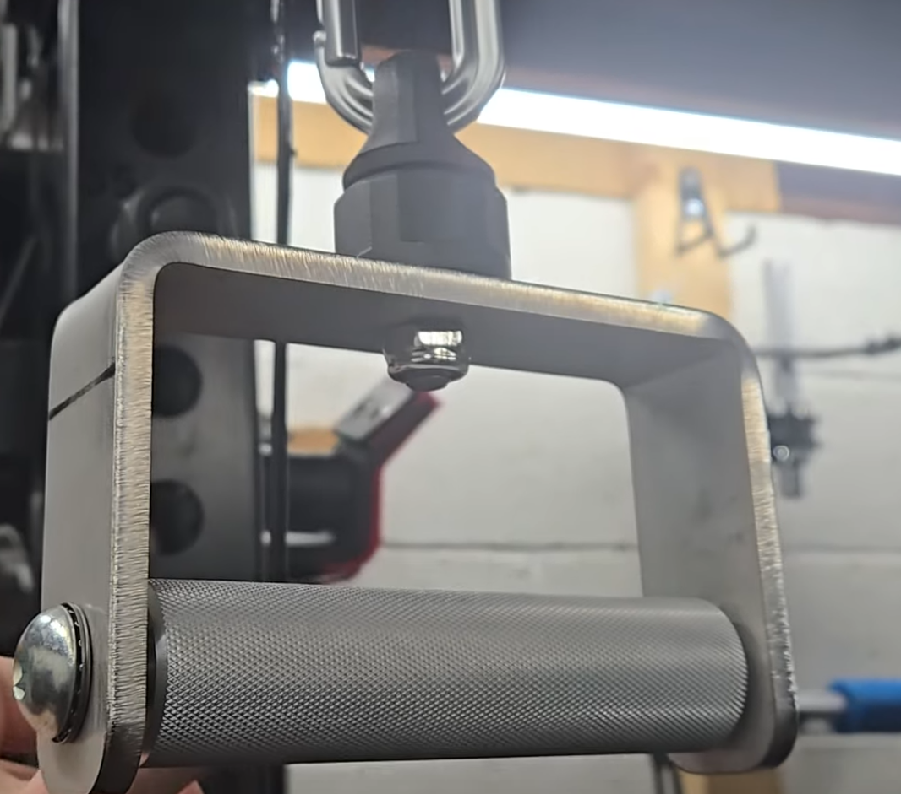

### 📁 Files

- [Closed Handle CAD file](tranman/scs-d-handle.step)

### 🛒 Parts & Supplies

- SCS should have two 90 degree bends:
- 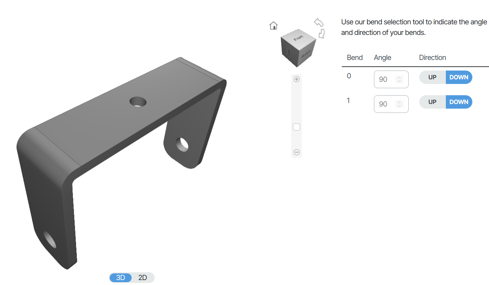

#### Attachment Hook

- Swivel Option [Adjustable Dumbbell Swivel Eye Hooks](https://eggweights.com/products/adjustable-dumbbell-swivel-eye-hooks) from Egg Weights
- Static eye bolt: [eye bolt](https://www.amazon.com/dp/B0CP3SBC9Q?th=1) + [bolt](https://www.amazon.com/dp/B0CN6KDBYK?ref=ppx_yo2ov_dt_b_fed_asin_title&th=1)

#### Handles

Choose from Rogue Fitness (Aluminum recommended for lighter weight):

- [Rogue H5 Multi-Grip Handles](https://www.roguefitness.com/rogue-h-5-multi-grip-and-cable-attachment-handles) (Aluminum or Stainless)
- [Rogue MG-4CN Narrow Multi-Grip Handles](https://www.roguefitness.com/rogue-mg-4cn-narrow-multi-grip-camber-bar) (Stainless)

---

## Tranman Angled Supported Curl Bracket

DIY modification that converts a Rogue V-Bar into an angled curl bar attachment with supported rotating handles. Features custom laser-cut brackets with foam roller pads for forearm support.

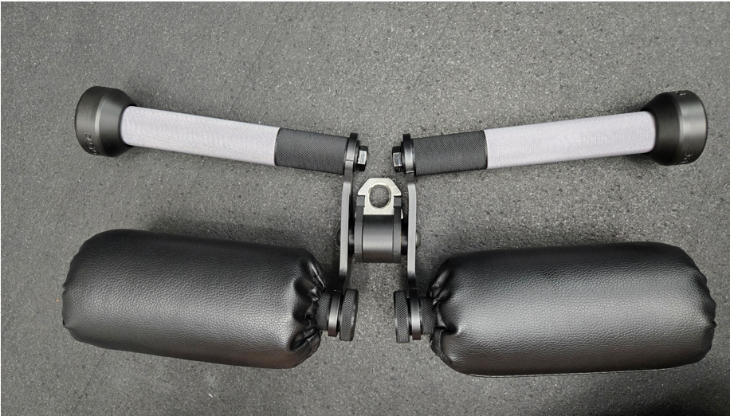
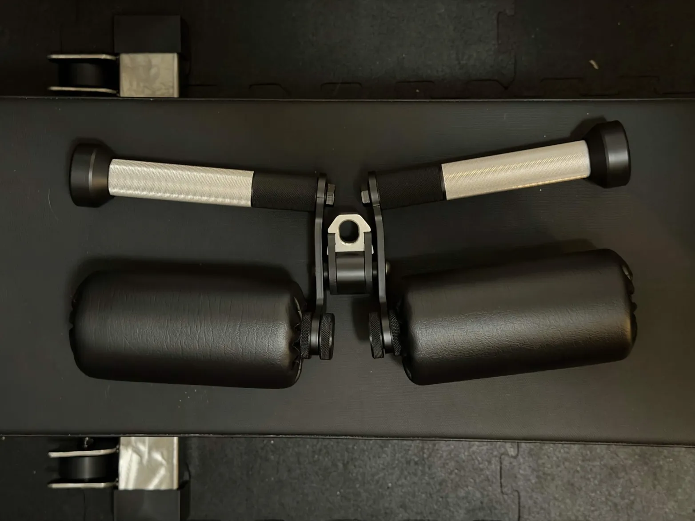
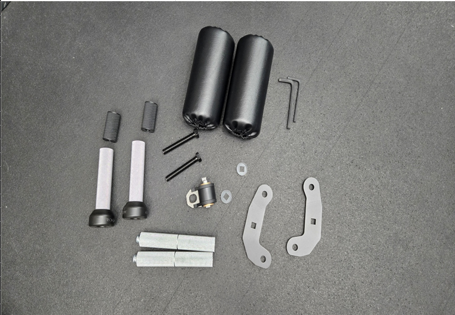

### 📁 Files

- [Left Bracket CAD file](tranman/angled-supported-curl-bracket-v6-left.step)
- [Right Bracket CAD file](tranman/angled-supported-curl-bracket-v6-right.step)
- [2-Hole Mod Left Bracket CAD file](tranman/angled-supported-curl-bracket-mod-2-hole-left.step)
- [2-Hole Mod Right Bracket CAD file](tranman/angled-supported-curl-bracket-mod-2-hole-right.step)
- [4-Hole Mod Left Bracket CAD file](tranman/angled-supported-curl-bracket-mod-4-hole-left.step)
- [4-Hole Mod Right Bracket CAD file](tranman/angled-supported-curl-bracket-mod-4-hole-right.step)
- [Screw Cover 32mm (3D Print)](tranman/d-handle-screw-cover-32mm.3mf)
- [Screw Cover 28.5mm (3D Print)](tranman/screw-cover-28.5mm.3mf)

### 🔧 Materials & Specifications

- **Bracket Material:** 1/4" HRPO Mild Steel
- **Fabrication:** Laser cut with bends via [SendCutSend](https://www.sendcutsend.com) (recommend 1/4" HRPO Mild Steel) or [Oshcut](https://www.oshcut.com)

### 🛒 Parts & Supplies

| Part                                   | Qty | Price  | Link                                                                                                       | Notes                                                                          |
| -------------------------------------- | --- | ------ | ---------------------------------------------------------------------------------------------------------- | ------------------------------------------------------------------------------ |
| **Rogue V-Bar**                        | 1   | $95.00 | [Rogue Fitness](https://www.roguefitness.com/rogue-rotating-v-grip-cable-attachment)                       | Use the included 32mm handles & swivel                                         |
| **Foam Pads**                          | 2   | $21.99 | [Amazon](https://www.amazon.com/dp/B0CNRMZ797?th=1)                                                        | Any 7 inch foam pad with inner diameter should work fine                       |
| **Rogue 28.5mm Raw Aluminum Handles**  | 2   | $25.00 | [Rogue Fitness](https://www.roguefitness.com/rogue-h-5-multi-grip-and-cable-attachment-handles)            | Used to hold foam pads                                                         |
| **1/2-13 x 3.5 Inch Hex Bolt**         | 4   | $9.99  | [Amazon](https://www.amazon.com/dp/B08PY1NC8Z)                                                             | Used alongside 3D printed handle spacers to extend the handles by ~2.25 inches |
| **3D Printed Handle Spacer (32mm)**    | 2   | -      | [MakerWorld](https://makerworld.com/en/models/2586308-3d-printed-parts-for-diy-curl-bar#profileId-2853151) | 3D Printed Spacer used to extend handles                                       |
| **3D Printed Handle Spacer (28.5mm)**  | 2   | -      | [MakerWorld](https://makerworld.com/en/models/2586308-3d-printed-parts-for-diy-curl-bar#profileId-2853151) | 3D Printed Spacer used for foam pad handles                                    |
| **3D Printed Bushing Spacer**          | 2   | -      | [MakerWorld](https://makerworld.com/en/models/2586308-3d-printed-parts-for-diy-curl-bar#profileId-2853151) | Spacer used to close the gap for the handles                                   |
| **Metal Square-Hole Washer (Recommended)** | 4   | $16.14 / 25 | [McMaster 90452A108](https://www.mcmaster.com/product/90452A108) | Better durability than 3D printed washers for this build                      |
| **3D Printed Screw Covers (Optional)** | 2   | -      | Use 32mm or 28.5mm from files above                                                                        | Uses 1/2 - 13 bolts (same bolts used by Rogue for their handles)               |

### 📝 Assembly Notes

⚠️ **IMPORTANT:** Before installing the brackets to the swivel, make sure to install the handles and roller pads first. The assembly order is critical.

**Assembly Order:**

1. Install the 28.5mm handles with foam roller pads onto the brackets
2. Install the 32mm handles (extended with spacers if using)
3. Attach the assembled brackets to the V-Bar swivel

### 📐 SendCutSend Ordering Instructions

Follow these step-by-step instructions to order your custom brackets from SendCutSend:

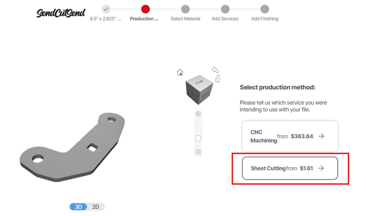

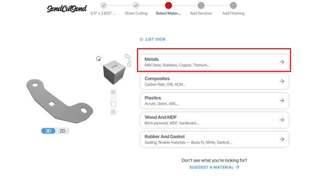

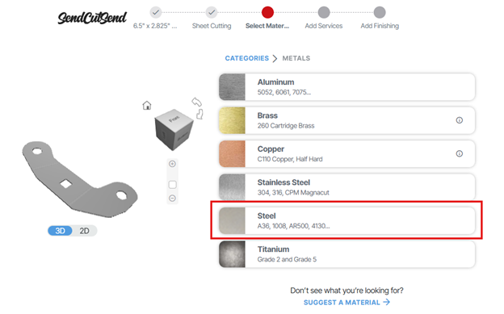

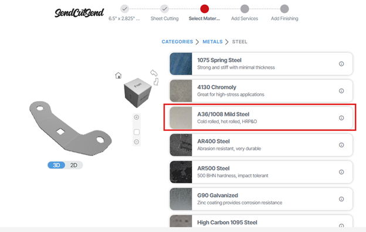

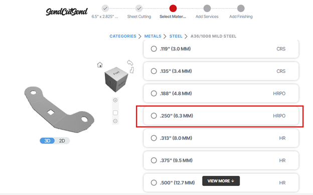

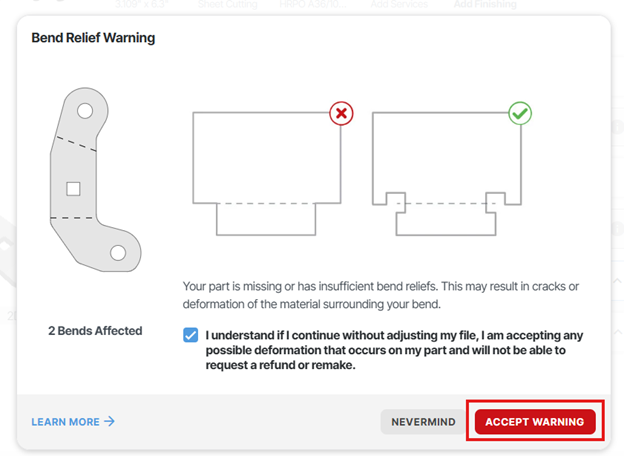

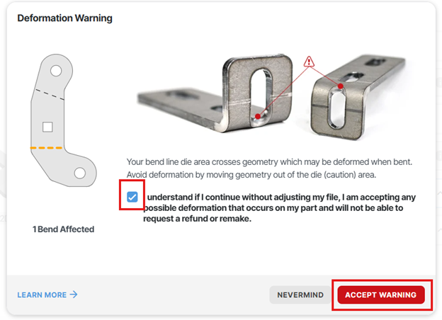

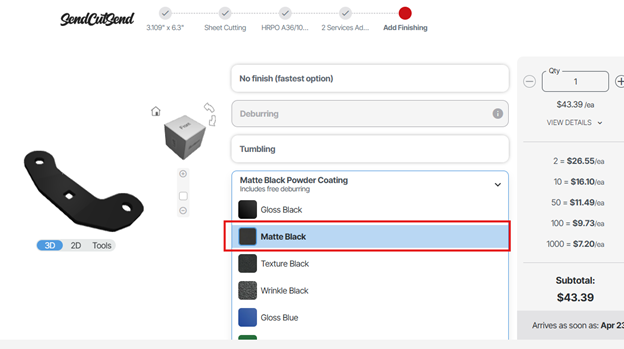

---

## Tranman Hammer Supported Curl Bracket

Hammer curl variant of the supported curl bracket design. Features angled foam pads for a neutral/hammer grip position.

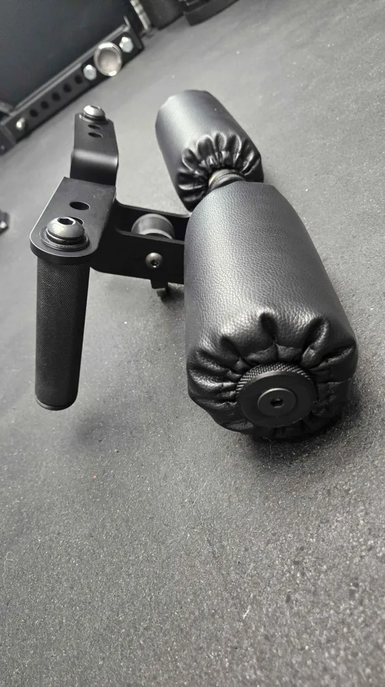

### 📁 Files

- [Left Bracket CAD file](tranman/hammer-supported-curl-bracket-vf-angled-pads-left.step)
- [Right Bracket CAD file](tranman/hammer-supported-curl-bracket-vf-angled-pads-right.step)
- [Screw Cover 32mm (3D Print)](tranman/d-handle-screw-cover-32mm.3mf)
- [Screw Cover 28.5mm (3D Print)](tranman/screw-cover-28.5mm.3mf)

### 🔧 Materials & Specifications

- **Bracket Material:** 1/4" HRPO Mild Steel
- **Fabrication:** Laser cut with bends via [SendCutSend](https://www.sendcutsend.com) (recommend 1/4" HRPO Mild Steel) or [Oshcut](https://www.oshcut.com)
- **Bracket Variants:** Original hammer bracket files plus two alternate mods: one version with 2 added holes and another with 4 added holes for extra adjustment options.

### 🆕 Alternate Bracket Mods

Two additional bracket variants are included for builders who want more mounting / adjustment positions than the original hammer bracket layout:

- **2-hole mod:** adds 2 extra holes total
- **4-hole mod:** adds 4 extra holes total

These variants are intended as alternate left/right bracket sets for the same hammer supported curl bracket build.

### 🛒 Parts & Supplies

| Part                                   | Qty | Price  | Link                                                                                                       | Notes                                                                          |
| -------------------------------------- | --- | ------ | ---------------------------------------------------------------------------------------------------------- | ------------------------------------------------------------------------------ |
| **Rogue V-Bar**                        | 1   | $95.00 | [Rogue Fitness](https://www.roguefitness.com/rogue-rotating-v-grip-cable-attachment)                       | Use the included 32mm handles & swivel                                         |
| **Foam Pads**                          | 2   | $21.99 | [Amazon](https://www.amazon.com/dp/B0CNRMZ797?th=1)                                                        | Any 7 inch foam pad with inner diameter should work fine                       |
| **Rogue 28.5mm Raw Aluminum Handles**  | 2   | $25.00 | [Rogue Fitness](https://www.roguefitness.com/rogue-h-5-multi-grip-and-cable-attachment-handles)            | Used to hold foam pads                                                         |
| **1/2-13 x 3.5 Inch Hex Bolt**         | 4   | $9.99  | [Amazon](https://www.amazon.com/dp/B08PY1NC8Z)                                                             | Used alongside 3D printed handle spacers to extend the handles by ~2.25 inches |
| **3D Printed Handle Spacer (32mm)**    | 2   | -      | [MakerWorld](https://makerworld.com/en/models/2586308-3d-printed-parts-for-diy-curl-bar#profileId-2853151) | 3D Printed Spacer used to extend handles                                       |
| **3D Printed Handle Spacer (28.5mm)**  | 2   | -      | [MakerWorld](https://makerworld.com/en/models/2586308-3d-printed-parts-for-diy-curl-bar#profileId-2853151) | 3D Printed Spacer used for foam pad handles                                    |
| **3D Printed Bushing Spacer**          | 2   | -      | [MakerWorld](https://makerworld.com/en/models/2586308-3d-printed-parts-for-diy-curl-bar#profileId-2853151) | Spacer used to close the gap for the handles                                   |
| **Metal Square-Hole Washer (Recommended)** | 4   | $16.14 / 25 | [McMaster 90452A108](https://www.mcmaster.com/product/90452A108) | Better durability than 3D printed washers for this build                      |
| **3D Printed Screw Covers (Optional)** | 2   | -      | Use 32mm or 28.5mm from files above                                                                        | Uses 1/2 - 13 bolts (same bolts used by Rogue for their handles)               |

### 📝 Assembly Notes

⚠️ **IMPORTANT:** Before installing the brackets to the swivel, make sure to install the handles and roller pads first. The assembly order is critical.

**Assembly Order:**

1. Install the 28.5mm handles with foam roller pads onto the brackets
2. Install the 32mm handles (extended with spacers if using)
3. Attach the assembled brackets to the V-Bar swivel

---

## Custom Grommets for Gymnastics Forza Iron Cross Handles (mech6)

Custom 3D printed grommets to protect the aluminum attachment holes on your [gymnastics forza iron cross handles](https://store.gymnasticsforza.com/products/gymnastics-forza-iron-cross-system). One smaller version provides coverage for one attachment hole on the handle, the other provides coverage for all attachment holes (excluding the holes that are covered by the bolts that hold the grommets in place).
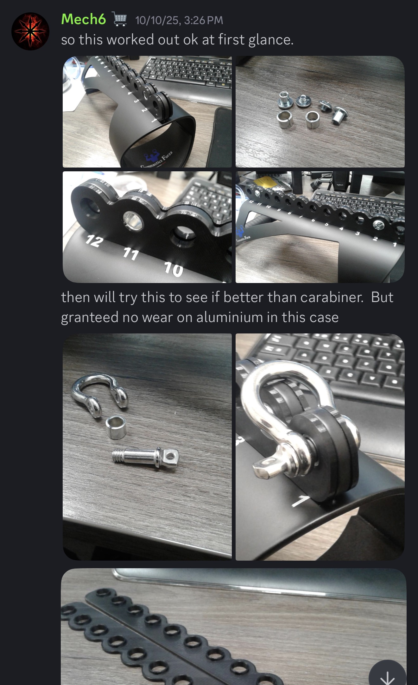

### 📁 Files

- [Larger STEP](mech6/larger-forza-version.STEP)
- [Smaller STEP](mech6/smaller-forza-version.STEP)

### 🔧 Specifications

- Designed for 3D printing; confirm exact thickness from the STEP before ordering/printing
- You may update the size holes in the STEP files to match your preferred swivel hooks or carabiners
- Recommend using PETG for 3D printing, **Need 4 total printed, two each handle** (print 4 of the larger STEP _OR_ 4 of the smaller STEP file)

### 📝 Notes

- Two STEP files are available, depending on whether you plan to utilize/protect one or all attachment holes
- 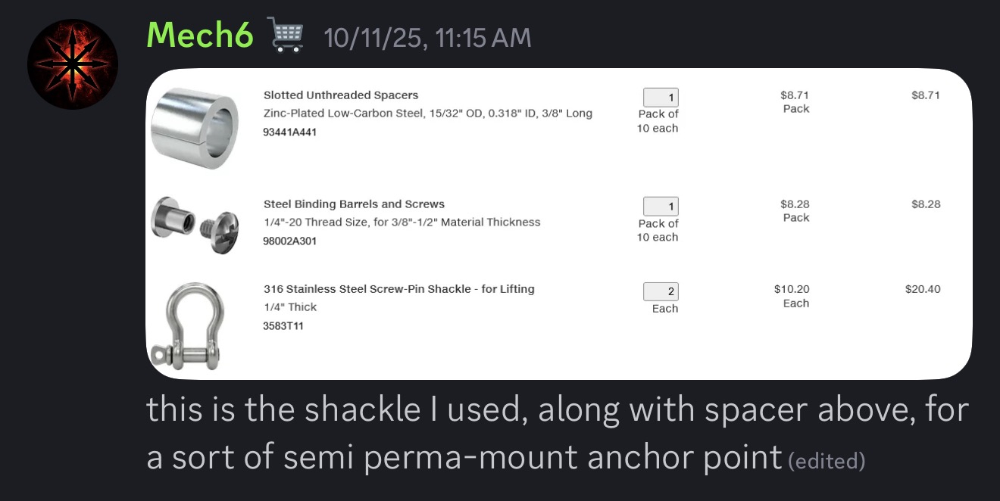
  - https://www.mcmaster.com/catalog/131/3736/93441A441
  - https://www.mcmaster.com/products/98002a301/
  - https://www.mcmaster.com/products/3583t11/

---

## Trak Kaz Knurled Handle (sinix)

Knurled handles designed for cable machine attachments with ergonomic grip. Would recommend printing in TPU to keep the rubber feel, however PETG/PLA will work too.

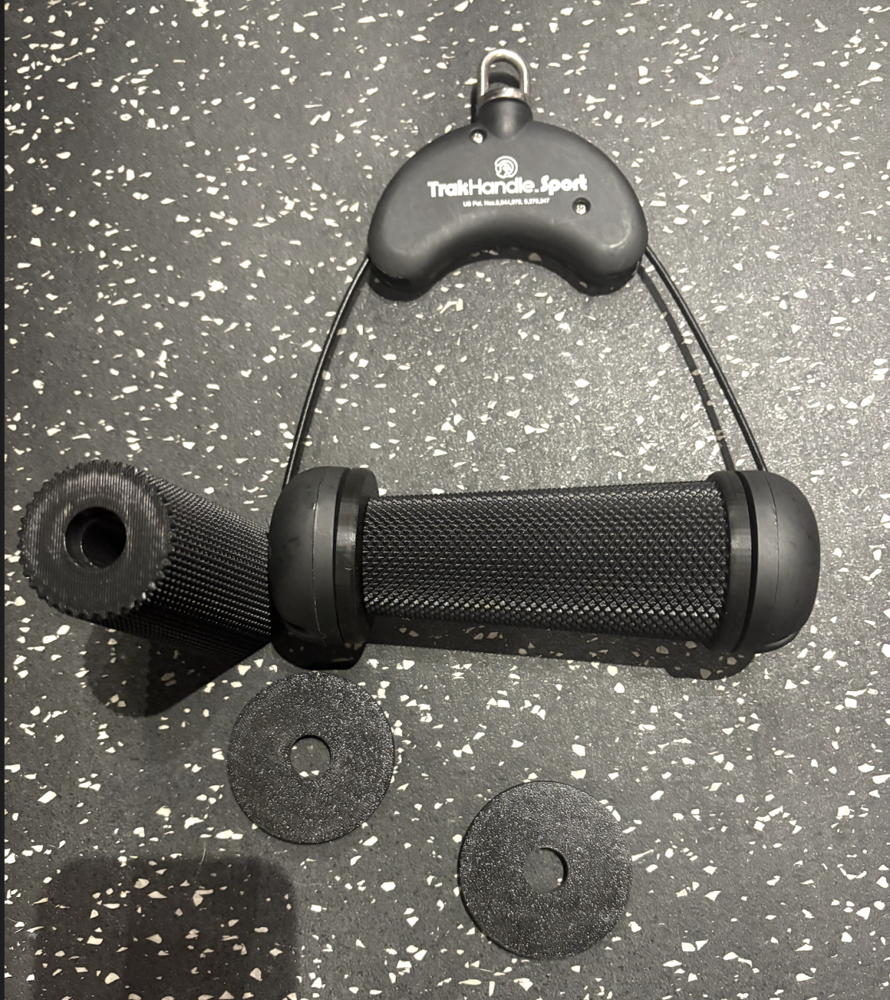

### 📁 Files

- [Trak Kaz Handles](sinix/Trak-Kaz-handles.stl)

## VTS Custom Rotating Handles (spohc)

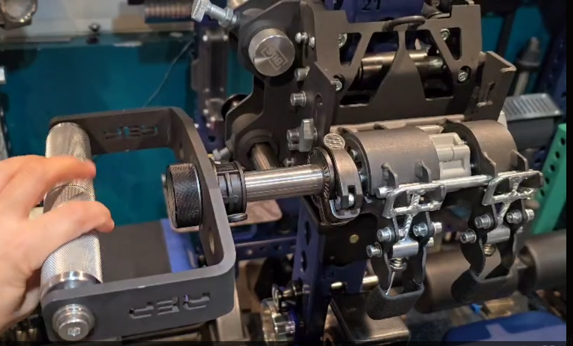

### 📁 Files

- No special files needed as these are built with off-the-shelf parts.

### 📝 Description

These custom rotating handles are built using parts from Rep Fitness Open Trap Bar handles and other standard gym hardware. The concept relies on the fact that many knurled handles (Rorman Strength Megalith, Rep Fitness Open Trap Bar, WM Fabs Mo Row, Giant Lifting) use the same M10-1.5 bolt size and thread pitch.

### 🛒 Parts & Supplies

#### Handles & Brackets

- [Rep Fitness Open Trap Bar Handles](https://repfitness.com/products/open-trap-bar-handles?variant=42225145643166)
  - _Note:_ Be careful when removing the bolts as they can strip easily. This set provides 3 pairs of handles to tinker with. The center bracket is the key component.

#### Mounting Hardware

- **Band Pegs:** 1" band peg required.
  - [Rogue Monster Band Pegs 2.0](https://www.roguefitness.com/monster-band-pegs-2-0-4-pack) (Recommended for flush fit)
  - Oak Club band pegs also work.
  - _Alternative:_ [Amazon Band Pegs](https://a.co/d/iRFunIt) (Check dimensions)
- **Collars:** Standard size weight collar to fasten the bracket.
  - [Example Collar](https://a.co/d/ddiLgF9)
- **Rotation:** Needle bearing washers are needed if you want the handles to rotate smoothly.
  - [Needle Bearing Washers](https://a.co/d/1qIFRCS)

### 💡 Tips

- You can save money by buying one of the other trap bar handle variants if you don't need the thick grips.
- Fringe Sport used to sell cheaper band pegs, but availability varies.
- A long enough bolt or rod could also work in place of a band peg.

---

## Rogue V-Bar Wide 120° Bracket (jv)

Replacement bracket for the [Rogue Rotating V-Grip Cable Attachment](https://www.roguefitness.com/rogue-rotating-v-grip-cable-attachment) that moves the handles out wider and flattens the handle angle to 120° (from the stock 90°).

### 📁 Files

- [Bracket STEP file](jv/rogue_v_bar_wide_120_deg_bracket/rogue_vbar_wide_120_bracket.step)
- [45mm Handle Flange STEP file](jv/rogue_v_bar_wide_120_deg_bracket/45mm_flange.step) (3D printed — any material works; original ordered in black dyed nylon from Xometry)

### 🔧 Materials & Specifications

- **Material:** 0.313" (5/16") Steel
- **Fabrication:** [Oshcut](https://www.oshcut.com) — the STEP file's bend radius and k-factor match the [Oshcut material catalog](https://app.oshcut.com/catalog/sheet) specs for 0.313" A36 / A1011 HR steel
- **Alternative:** Can be made in 1/4" steel via [SendCutSend](https://www.sendcutsend.com), but the bend radius and k-factor will not match their material specs and will be auto-adjusted
- **Hardware:** 3/8" washer required to ensure full contact with the center bracket. If using 1/4" steel, the washer must be > 1/16" thick
- **Handles:** Designed for 45mm diameter [Rogue H5 Multi-Grip Handles](https://www.roguefitness.com/rogue-h-5-multi-grip-and-cable-attachment-handles). You can use the 32mm handles included with the V-Bar, but the bracket will be significantly wider if you go that route.

### 🛒 Parts & Supplies

- [Rogue Rotating V-Grip Cable Attachment](https://www.roguefitness.com/rogue-rotating-v-grip-cable-attachment) (donor attachment — bracket replaces the stock V bracket)
- 2 x 5/16" steel bracket (from STEP)
- 2 x [3/8" Washer](https://www.mcmaster.com/98026A113/) (example from McMaster-Carr)
- 2 x [Rogue H5 Multi-Grip Handles (45mm)](https://www.roguefitness.com/rogue-h-5-multi-grip-and-cable-attachment-handles) — $55
- 2 x 3D printed 45mm flange (from STEP)
