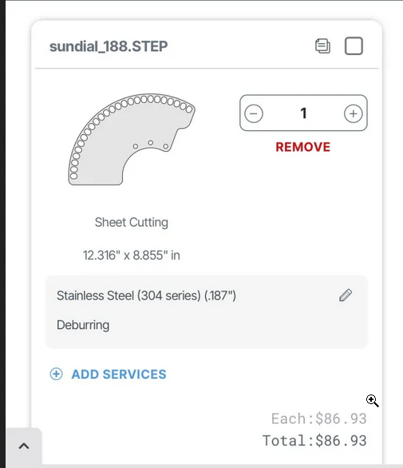
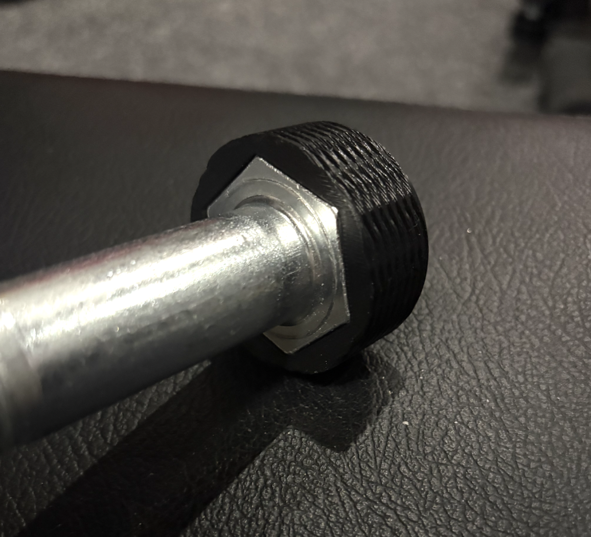
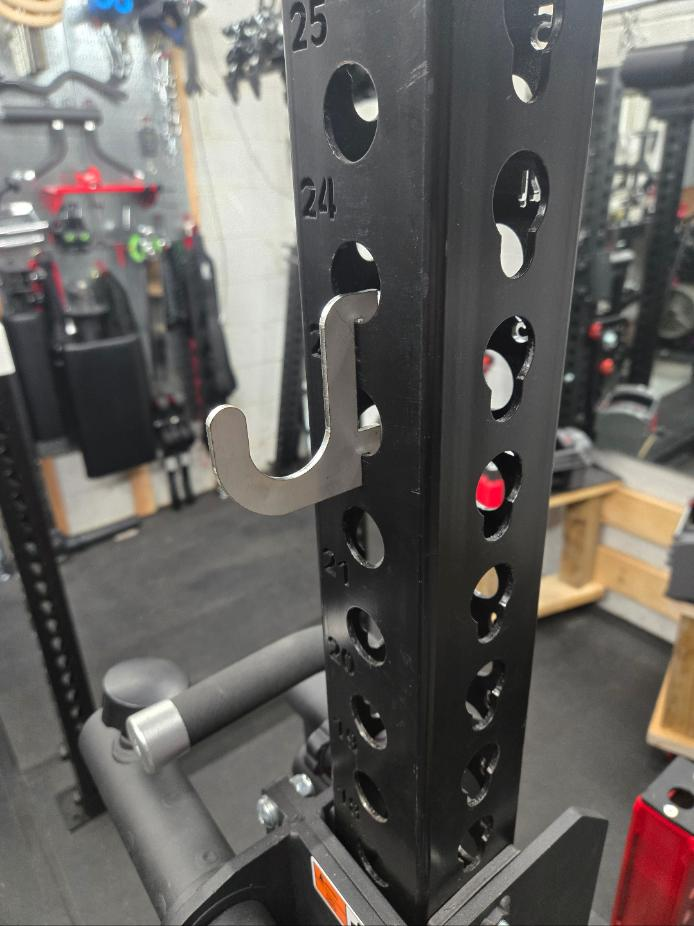
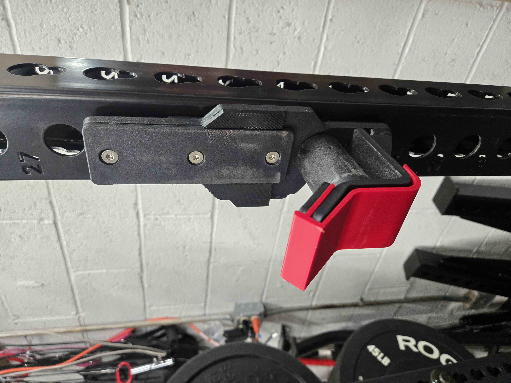
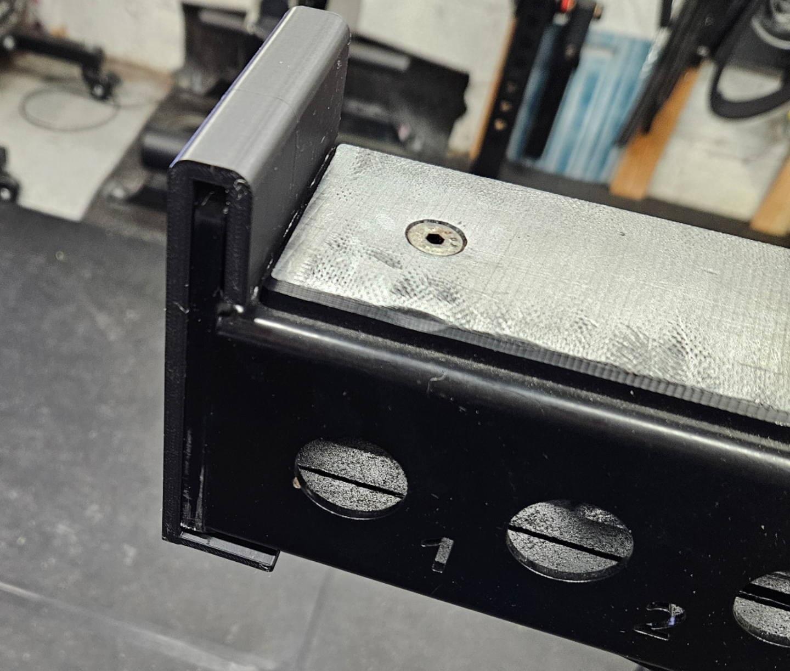

Custom utility accessories for racks, benches, and cable systems.

## Table of Contents

- [Mech6 - Larger Sundial for Prime Stability Arm](#mech6---larger-sundial-for-prime-stability-arm)
- [Sinix – Knurled Hex Nut for 1" Rack Bolts](#sinix--knurled-hex-nut-for-1-rack-bolts)
- [Ryan – Power Rack Utility Hook](#ryan--power-rack-utility-hook)
- [Ryan – Iron Master Super Bench Pro v2 Stand](#ryan--iron-master-super-bench-pro-v2-stand)
- [Ryan – Replacement Pads for Darko Barbell Anchor](#ryan--replacement-pads-for-darko-barbell-anchor)
- [Ryan – Replacement Pads for Darko Thresher Pad](#ryan--replacement-pads-for-darko-thresher-pad)
- [Ryan – Titan Roller J-Cup Protectors](#ryan--titan-roller-j-cup-protectors)
- [Ryan – Rogue Monster Safety Spotter Lip Protector](#ryan--rogue-monster-safety-spotter-lip-protector)

---

## Mech6 - Larger Sundial for Prime Stability Arm

### 📁 Files

- [Sundail upgrade](mech6/sundial%20188.STEP) — 4 mm stainless sheet

### 📦 Part Overview
Larger Sundial for Prime Stability Arm by Mech6 (enables locking upright storage)
- 

### 🔧 Specifications

- Critical measurements: SendCutSend settings: .187" thick, deburring
- Mounting or hardware details: Uses stock hardware from the original prime stability arm

---

## Sinix – Knurled Hex Nut for 1" Rack Bolts

### 📁 Files
- 
- [Knurled hex nut STEP](sinix/Knurled-Hex-Nut-36-v2.step)

### 🔧 Specifications

- 3D printed knurled nut for 1" diameter rack bolts
- Compatible with Rep Fitness and Rogue rack hardware
- Knurled exterior for easy hand tightening without tools

### 📝 Notes

- Print in PETG or PLA for best rigidity
- Knurled pattern provides grip for tool-free adjustment of accessories
- Ideal for quick-adjust attachments on power racks

### 📝 Credits

Design by Sinix

---

## Ryan – Power Rack Utility Hook

### 📁 Files

- [Utility hook DXF](markofzen/hook-4-mm-thick.dxf) — 4 mm stainless sheet

### 🔧 Specifications

- 4 mm stainless steel (SendCutSend stainless recommended)
- Designed for media tumble + optional powder coat

### 💰 Cost Reference

- ≈ $30 + shipping for twelve hooks in stainless via SendCutSend

### 📝 Credits

Design by Ryan (markofzen)

---

## Ryan – Iron Master Super Bench Pro v2 Stand

### 📁 Files

- [Makerworld print model](https://makerworld.com/en/models/919545-iron-master-super-bench-pro-v2-kickstand)

### 📝 Notes

- Custom kickstand keeps the Super Bench upright when swapping pads
- Print in high infill PETG or ABS for rigidity

### 📝 Credits

Design by Ryan (markofzen)

---

## Ryan – Replacement Pads for Darko Barbell Anchor

### 📁 Files

- [Makerworld print model](https://makerworld.com/en/models/1290776-replacement-pads-for-darko-barbell-anchor)

### 📝 Notes

- Drop-in pads prevent metal-on-metal contact inside the Darko anchor
- Print with flexible TPU for additional grip or PETG for rigidity

### 📝 Credits

Design by Ryan (markofzen)

---

## Ryan – Replacement Pads for Darko Thresher Pad

### 📁 Files

- [Makerworld print model](https://makerworld.com/en/models/1921564-replacement-pads-for-darko-thresher-pad)

### 📝 Notes

- Protects the Thresher pad shell and improves bar grip
- Print in TPU or PETG depending on desired feel

### 📝 Credits

Design by Ryan (markofzen)

---

## Ryan – Titan Roller J-Cup Protectors

Protective inserts for Titan Roller J-Cups to prevent barbell or cup damage.

### Original Twist-Lock Front Lip

- [Makerworld print model](https://makerworld.com/en/models/762864-titan-roller-j-cup-lip-protector#profileId-697722)

### Pop-Pin Front Lip

- [Makerworld print model](https://makerworld.com/en/models/762864-titan-roller-j-cup-lip-protector#profileId-1661999)

### Back Protector

- [Makerworld print model](https://makerworld.com/en/models/860577-titan-roller-j-cup-back-protector#profileId-1661765)

### 📝 Notes

- Print in PETG or nylon for durability; add TPU pads where you want extra grip
- Optional countersunk screws secure the protectors if you expect heavy impacts

### 📝 Credits

Designs by Ryan (markofzen)

---

## Ryan – Rogue Monster Safety Spotter Lip Protector

### 📁 Files

- [Makerworld print model](https://makerworld.com/en/models/780544-rogue-monster-safety-spotter-arm-20-lip-protector#profileId-724695)

### 📝 Notes

- Slide-on protector prevents bar knurling damage when dumping onto Monster 2.0 spotter arms
- Print with >30% infill PETG or ABS for impact resistance

### 📝 Credits

Design by Ryan (markofzen)
