Custom utility accessories for racks, benches, and cable systems.

## Table of Contents

- [Table of Contents](#table-of-contents)
- [Mech6 - Larger Sundial for Prime Stability Arm](#mech6---larger-sundial-for-prime-stability-arm)
  - [📁 Files](#-files)
  - [📦 Part Overview](#-part-overview)
  - [🔧 Specifications](#-specifications)
- [Sinix – Knurled Hex Nut for 1" Rack Bolts](#sinix--knurled-hex-nut-for-1-rack-bolts)
  - [📁 Files](#-files-1)
  - [🔧 Specifications](#-specifications-1)
  - [📝 Notes](#-notes)
  - [📝 Credits](#-credits)
- [Ryan – Power Rack Utility Hook](#ryan--power-rack-utility-hook)
  - [📁 Files](#-files-2)
  - [🔧 Specifications](#-specifications-2)
  - [💰 Cost Reference](#-cost-reference)
  - [📝 Credits](#-credits-1)
- [Ryan – Iron Master Super Bench Pro v2 Stand](#ryan--iron-master-super-bench-pro-v2-stand)
  - [📁 Files](#-files-3)
  - [📝 Notes](#-notes-1)
  - [📝 Credits](#-credits-2)
- [Ryan – Replacement Pads for Darko Barbell Anchor](#ryan--replacement-pads-for-darko-barbell-anchor)
  - [📁 Files](#-files-4)
  - [📝 Notes](#-notes-2)
  - [📝 Credits](#-credits-3)
- [Ryan – Replacement Pads for Darko Thresher Pad](#ryan--replacement-pads-for-darko-thresher-pad)
  - [📁 Files](#-files-5)
  - [📝 Notes](#-notes-3)
  - [📝 Credits](#-credits-4)
- [Ryan – Titan Roller J-Cup Protectors](#ryan--titan-roller-j-cup-protectors)
  - [Original Twist-Lock Front Lip](#original-twist-lock-front-lip)
  - [Pop-Pin Front Lip](#pop-pin-front-lip)
  - [Back Protector](#back-protector)
  - [📝 Notes](#-notes-4)
  - [📝 Credits](#-credits-5)
- [Ryan – Rogue Monster Safety Spotter Lip Protector](#ryan--rogue-monster-safety-spotter-lip-protector)
  - [📁 Files](#-files-6)
  - [📝 Notes](#-notes-5)
  - [📝 Credits](#-credits-6)
- [Schnibbz – MM SBR Lip Protector](#schnibbz--mm-sbr-lip-protector)
  - [📁 Files](#-files-7)
  - [🖨️ Print Settings](#️-print-settings)
  - [📝 Notes](#-notes-6)
  - [📝 Credits](#-credits-7)
- [Rogue Black Oxide Bolts (Anand)](#rogue-black-oxide-bolts-anand)
  - [🛒 Parts \& Supplies](#-parts--supplies)
  - [📝 Notes](#-notes-7)
- [JW – Spot Grips Reppin Mod Template](#jw--spot-grips-reppin-mod-template)
  - [📁 Files](#-files-8)
  - [📝 Notes](#-notes-8)
  - [📝 Credits](#-credits-8)
- [V-Bar Swivel Shackle (jv)](#v-bar-swivel-shackle-jv)
  - [📁 Files](#-files-9)
  - [🔧 Specifications](#-specifications-3)
  - [⚠️ Differences from the Stock Rogue V-Bar Swivel](#️-differences-from-the-stock-rogue-v-bar-swivel)
  - [🛒 Parts \& Supplies](#-parts--supplies-1)
  - [🔨 Assembly](#-assembly)
  - [📝 Credits](#-credits-9)
- [Ryan \& Carter – Bremmy Return Roller](#ryan--carter--bremmy-return-roller)
  - [📁 Files](#-files-10)
  - [🖨️ Print Settings](#️-print-settings-1)
  - [📝 Notes](#-notes-9)
  - [📝 Credits](#-credits-10)

---

## Mech6 - Larger Sundial for Prime Stability Arm

### 📁 Files

- [Sundail upgrade](mech6/sundial%20188.STEP) — 4 mm stainless sheet

### 📦 Part Overview
Larger Sundial for Prime Stability Arm by Mech6 (enables locking upright storage)
- 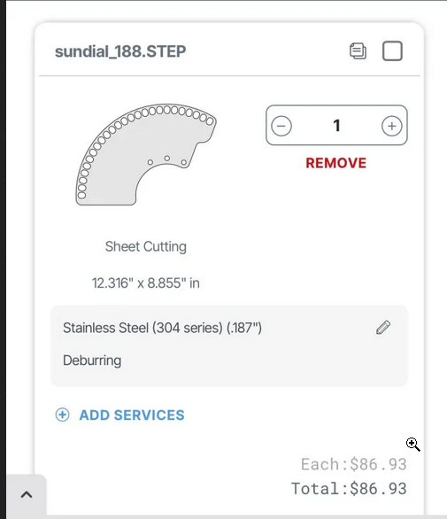

### 🔧 Specifications

- Critical measurements: SendCutSend settings: .187" thick, deburring
- Mounting or hardware details: Uses stock hardware from the original prime stability arm

---

## Sinix – Knurled Hex Nut for 1" Rack Bolts

### 📁 Files
- 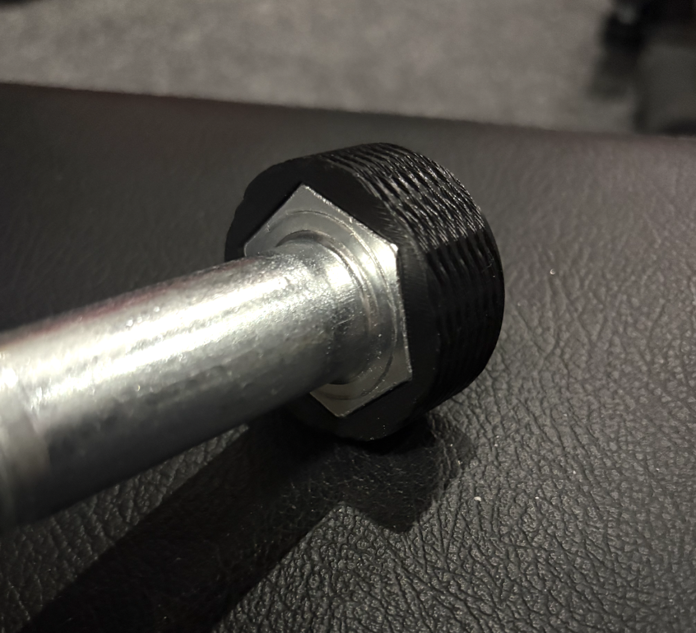
- [Knurled hex nut STEP](sinix/Knurled-Hex-Nut-36-v2.step)

### 🔧 Specifications

- 3D printed knurled nut for 1" diameter rack bolts
- Compatible with Rep Fitness and Rogue rack hardware
- Knurled exterior for easy hand tightening without tools

### 📝 Notes

- Print in PETG or PLA for best rigidity
- Knurled pattern provides grip for tool-free adjustment of accessories
- Ideal for quick-adjust attachments on power racks

### 📝 Credits

Design by Sinix

---

## Ryan – Power Rack Utility Hook

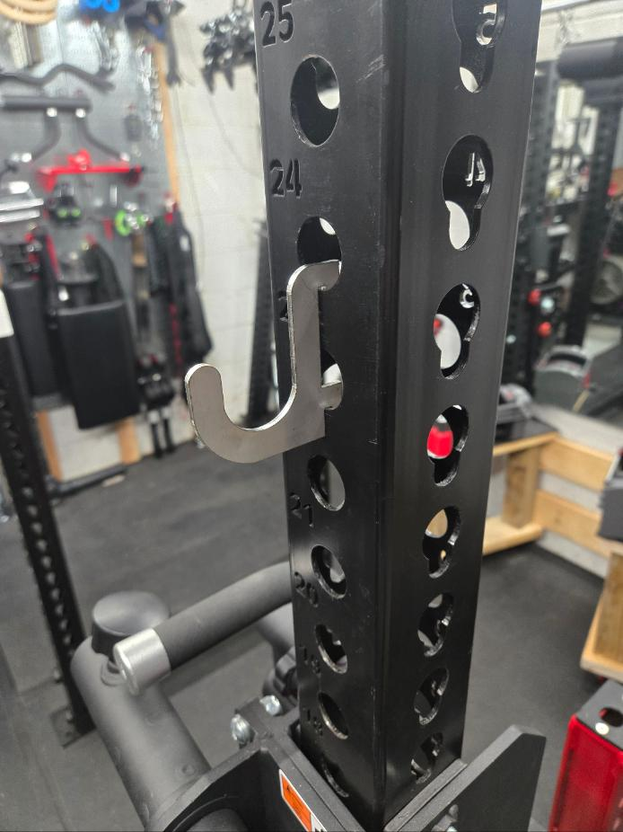

### 📁 Files

- [Utility hook DXF](markofzen/hook-4-mm-thick.dxf) — 4 mm stainless sheet

### 🔧 Specifications

- 4 mm stainless steel (SendCutSend stainless recommended)
- Designed for media tumble + optional powder coat

### 💰 Cost Reference

- ≈ $30 + shipping for twelve hooks in stainless via SendCutSend

### 📝 Credits

Design by Ryan (markofzen)

---

## Ryan – Iron Master Super Bench Pro v2 Stand

### 📁 Files

- [Makerworld print model](https://makerworld.com/en/models/919545-iron-master-super-bench-pro-v2-kickstand)

### 📝 Notes

- Custom kickstand keeps the Super Bench upright when swapping pads
- Print in high infill PETG or ABS for rigidity

### 📝 Credits

Design by Ryan (markofzen)

---

## Ryan – Replacement Pads for Darko Barbell Anchor

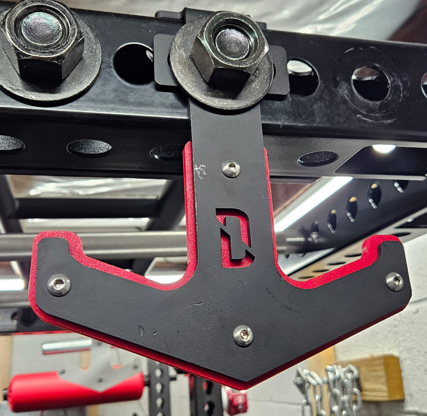

### 📁 Files

- [Makerworld print model](https://makerworld.com/en/models/1290776-replacement-pads-for-darko-barbell-anchor)

### 📝 Notes

- Drop-in pads prevent metal-on-metal contact inside the Darko anchor
- Print with flexible TPU for additional grip or PETG for rigidity

### 📝 Credits

Design by Ryan (markofzen)

---

## Ryan – Replacement Pads for Darko Thresher Pad

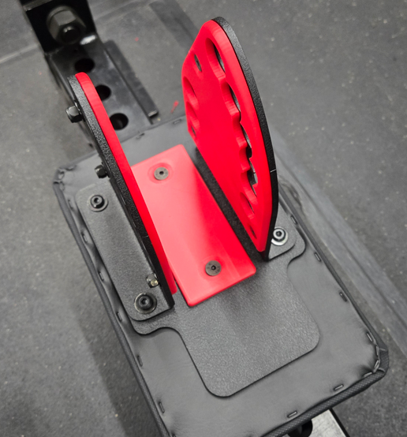

### 📁 Files

- [Makerworld print model](https://makerworld.com/en/models/1921564-replacement-pads-for-darko-thresher-pad)

### 📝 Notes

- Protects the Thresher pad shell and improves bar grip
- Print in TPU or PETG depending on desired feel

### 📝 Credits

Design by Ryan (markofzen)

---

## Ryan – Titan Roller J-Cup Protectors

Protective inserts for Titan Roller J-Cups to prevent barbell or cup damage.

### Original Twist-Lock Front Lip

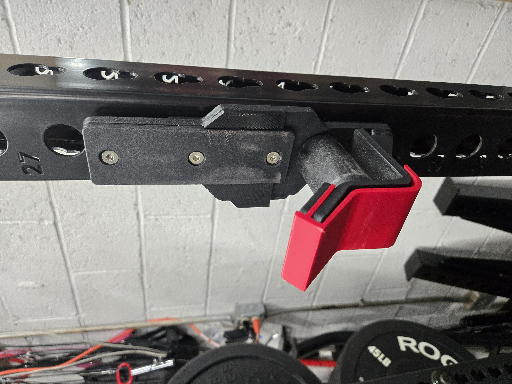

- [Makerworld print model](https://makerworld.com/en/models/762864-titan-roller-j-cup-lip-protector#profileId-697722)

### Pop-Pin Front Lip

- [Makerworld print model](https://makerworld.com/en/models/762864-titan-roller-j-cup-lip-protector#profileId-1661999)

### Back Protector

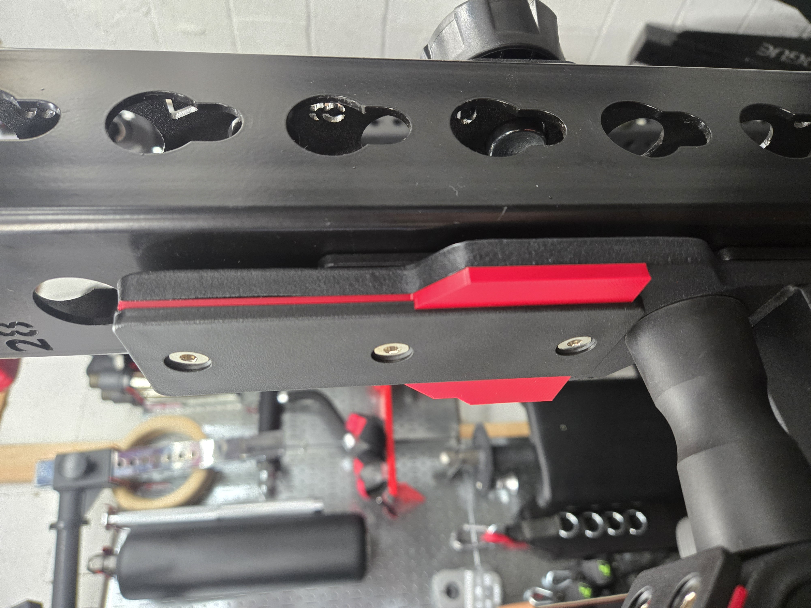

- [Makerworld print model](https://makerworld.com/en/models/860577-titan-roller-j-cup-back-protector#profileId-1661765)

### 📝 Notes

- Print in PETG or nylon for durability; add TPU pads where you want extra grip
- Optional countersunk screws secure the protectors if you expect heavy impacts

### 📝 Credits

Designs by Ryan (markofzen)

---

## Ryan – Rogue Monster Safety Spotter Lip Protector

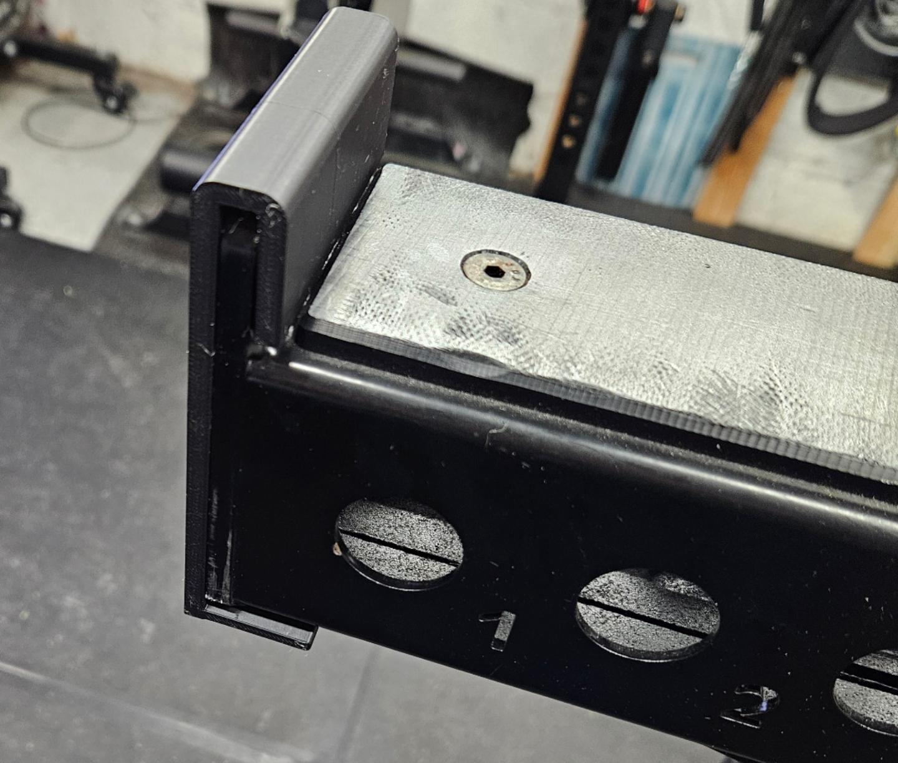

### 📁 Files

- [Makerworld print model](https://makerworld.com/en/models/780544-rogue-monster-safety-spotter-arm-20-lip-protector#profileId-724695)

### 📝 Notes

- Slide-on protector prevents bar knurling damage when dumping onto Monster 2.0 spotter arms
- Print with >30% infill PETG or ABS for impact resistance

### 📝 Credits

Design by Ryan (markofzen)

---

## Schnibbz – MM SBR Lip Protector

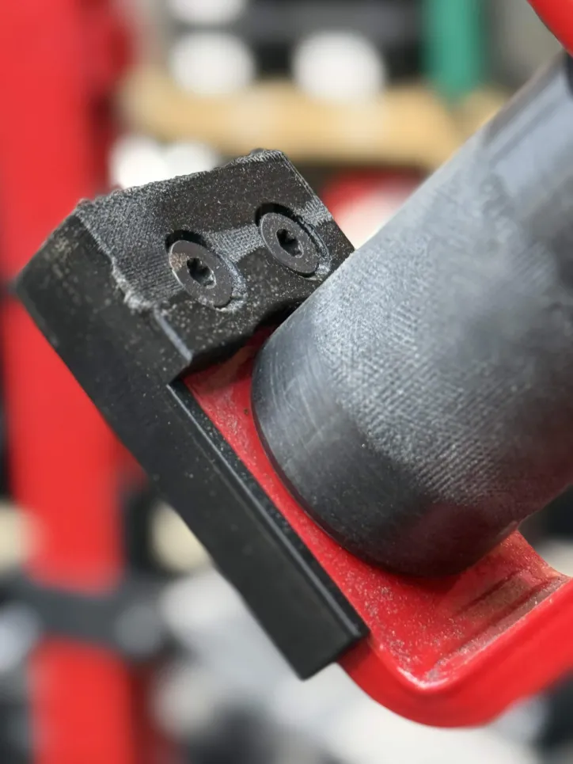

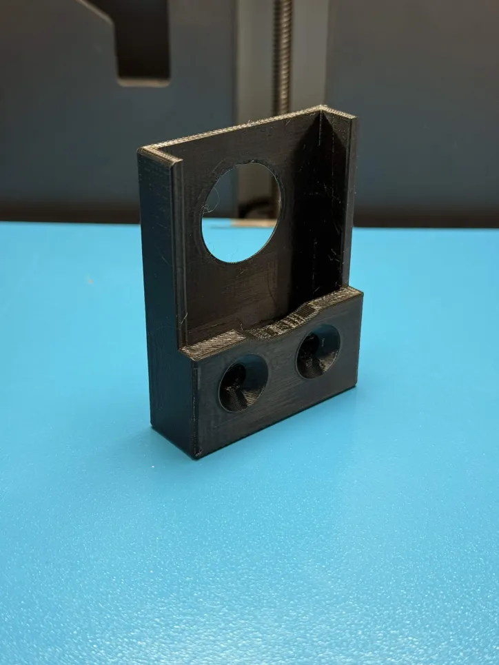

### 📁 Files

- [MM SBR Lip Protector 3MF](schnibbz/MM-SBR-Lip-Protector.3mf)

### 🖨️ Print Settings

- Material: PETG
- Infill: 100% (recommended)

### 📝 Notes

- Lip protector insert for MM SBR contact area
- Countersunk screw holes help keep hardware flush

### 📝 Credits

Design by Schnibbz

---
## Rogue Black Oxide Bolts (Anand)

### 🛒 Parts & Supplies

- **Black Oxide 2.5" Washer:** [Grainger Link](https://www.grainger.com/product/USS-Washer-Case-Hardened-22UE19)
- **Black Oxide 1" Bolt:** [Grainger Link](https://www.grainger.com/product/Hex-Head-Cap-Screw-Steel-25CL18)
- **Black Oxide 1.5" Nut:** [Grainger Link](https://www.grainger.com/product/Hex-Nut-Std-Hex-12P505)
- **Black Oxide Locking Washer:** [Grainger Link](https://www.grainger.com/product/Split-Lock-Washer-Case-Hardened-22UH39?opr=PDPBRDSP&analytics=dsbrItems_22UE11)

### 📝 Notes

These links are for the black oxide versions of the hardware.

---

## JW – Spot Grips Reppin Mod Template

### 📁 Files

- [Spot Grips Reppin Mod Cutting Template (pdf)](https://github.com/user-attachments/files/26027383/Spot_Grips_Reppin_Mod_Cutting_Template.pdf)

### 📝 Notes

- Print the template at 100% scale and confirm the scale with a measuring tape in inches
- Cut out the template and affix to one of the sides of the Spot Grips as shown - trace with a silver sharpie
- Cut with the equipment listed below:
-   -Jigsaw with a thick metal Bosch blade (or similar)
-   -Tap magic (or similar) cutting fluid
-   -Work surface and clamps
-   -Personal protective equipment - be safe!

  Note: it’s likely best to leave more material and you can shave it down later as you test the fit with your dumbbells

### 📝 Credits

- Design by JW
- Credit to LzrJ who took his Spot Grips to a local fab to have his cut for his Pepin Fast Adjustables, and who shared measurements of his Spot Grips after

---

## V-Bar Swivel Shackle (jv)

Replica of the swivel shackle from the [Rogue Rotating V-Grip Cable Attachment](https://www.roguefitness.com/rogue-rotating-v-grip-cable-attachment). The shackle body and side plates are laser-cut steel; the spacer is 3D printed and accepts three metal standoffs that clamp the assembly together.

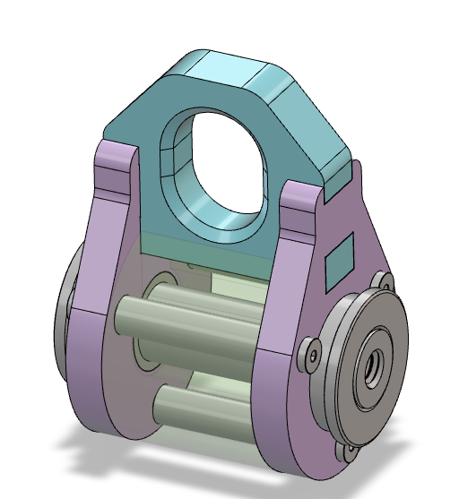

Build photos:

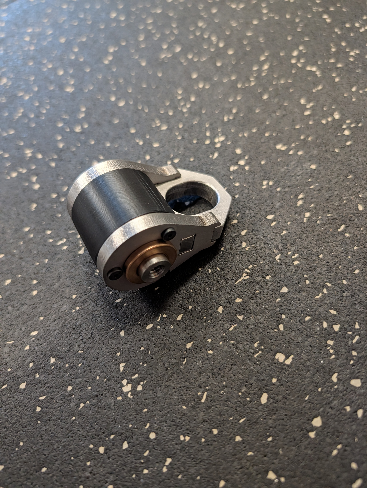
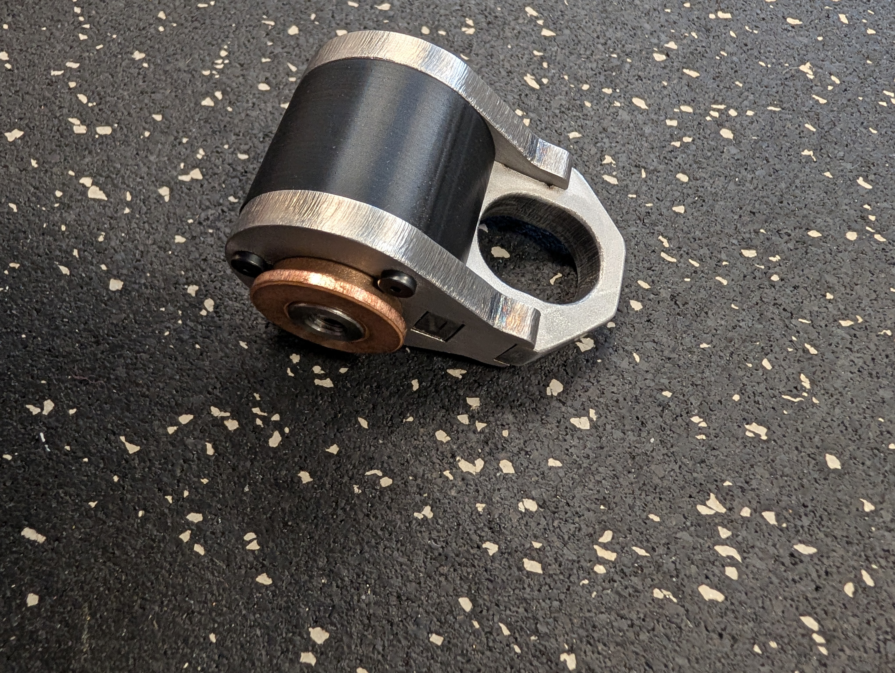
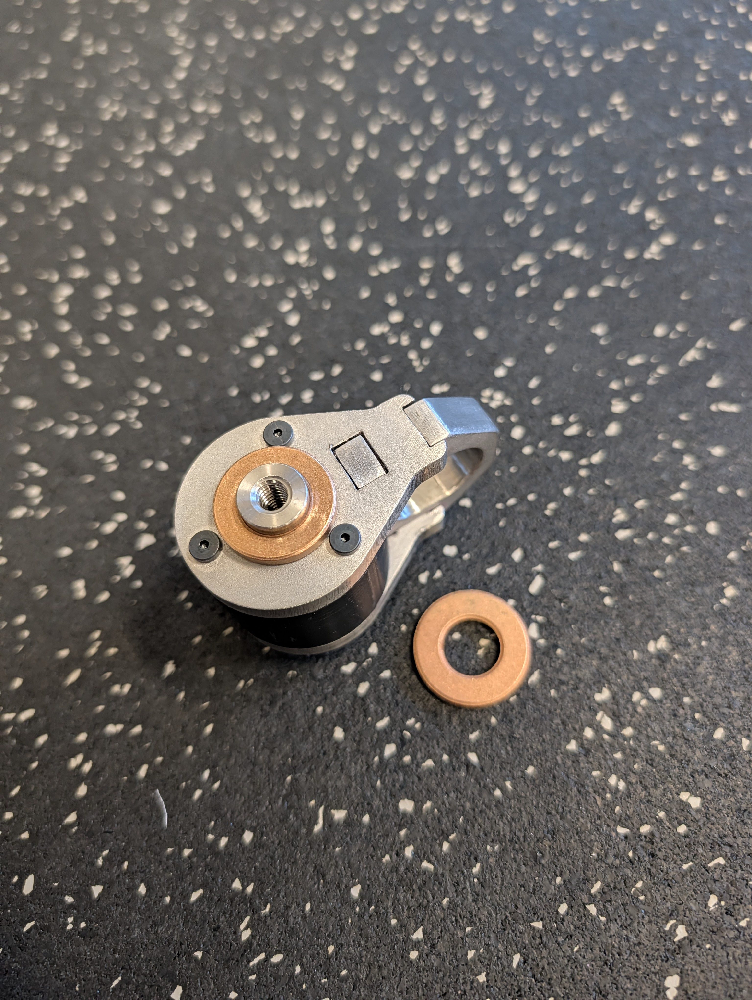

### 📁 Files

- [Shackle STEP](jv/vbar_swivel_shackle/cad/vbss_shackle.step)
- [Side Plate STEP](jv/vbar_swivel_shackle/cad/vbss_side_plate.step)
- [Spacer STEP](jv/vbar_swivel_shackle/cad/vbss_spacer.step)

### 🔧 Specifications

- **Side plates (×2):** 304 stainless, 0.250" (1/4") thick
- **Shackle (×1):** 304 stainless, 0.375" (3/8") thick
- **Shaft:** 1/2" OD, 2" long, 1/4"-20 female threaded standoff
- **Spacer body (×1):** 3D printed from the STEP file — has three pockets that accept the standoffs listed below

SendCutSend cost for the laser-cut parts (before shipping/tax): **$18.96** — $11.46 for the pair of side plates + $7.50 for the shackle.

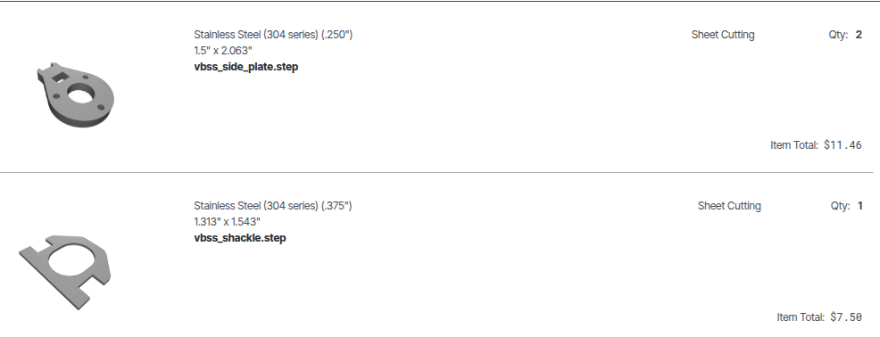

### ⚠️ Differences from the Stock Rogue V-Bar Swivel

The shaft is a plain cylinder with no key or flat, so the two side plates are only constrained in rotation around the shaft axis by friction from the clamping force. The original Rogue V-Bar swivel uses a keyed shaft that locks the sides together in rotation — this replica swivels normally on the cable attachment point but does not replicate that side-plate locking behavior.

### 🛒 Parts & Supplies

- **Screws (×6):** 6-32, 5/8" long — [McMaster 92220A144](https://www.mcmaster.com/92220A144/) ($13.94 / pack of 25)
- **Standoffs (×3):** 1/4" OD, 1" long, 6-32 female threaded standoff — [McMaster 93265A449](https://www.mcmaster.com/93265A449/) ($1.09 ea) — press-fit into the 3D-printed spacer body
- **Shaft (×1):** 1/2" OD, 2" long, 1/4"-20 female threaded standoff — [McMaster 91125A652](https://www.mcmaster.com/91125A652/) ($7.33 ea)
- **Flanged sleeve bearings (×2):** 1/2" shaft dia., 5/8" housing ID, 3/8" long — [McMaster 1677K7](https://www.mcmaster.com/1677K7/) ($2.08 ea)
- **Thrust washers (×2):** 1/2" shaft dia., 1" OD, 3/32" thick — [McMaster 7421K6](https://www.mcmaster.com/7421K6/) ($1.80 ea)

The two flanged sleeve bearings and two thrust washers can be replaced with 3D printed flanged bushings.

### 🔨 Assembly

1. Press the three standoffs into the pockets in the 3D-printed spacer body. They should seat fully; if the print tolerance is tight, tap them in with a hammer.
2. Sandwich the spacer+standoff assembly between the two side plates, capturing the shackle in the side plate cutouts.
3. Drive the six 6-32 screws through the side plates into the standoffs — three per side — clamping the stack together.
4. The shaft, bearings, and thrust washers (or 3D-printed flanged bushings) install in the shackle body and pass through the large center holes in the side plates to complete the swivel.

### 📝 Credits
Design by jv

---
Design by jv
## Ryan & Carter – Bremmy Return Roller

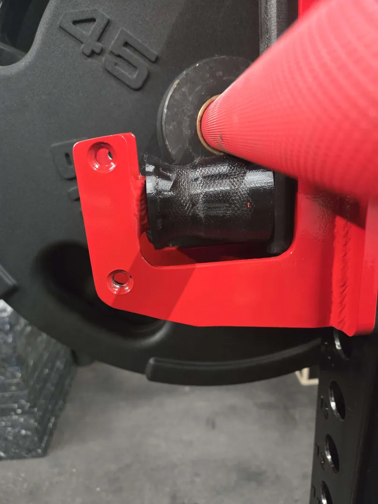

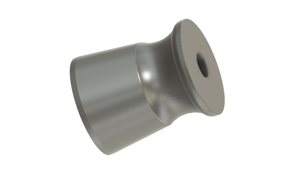

### 📁 Files

- [Bremmy Return Roller 3MF](markofzen/final-rollers.3mf)

### 🖨️ Print Settings

- Material: PETG
- Infill: 60%
- Infill Pattern: Gyroid

### 📝 Notes

- Roller includes a return mechanism

### 📝 Credits

Design by Ryan & Carter

