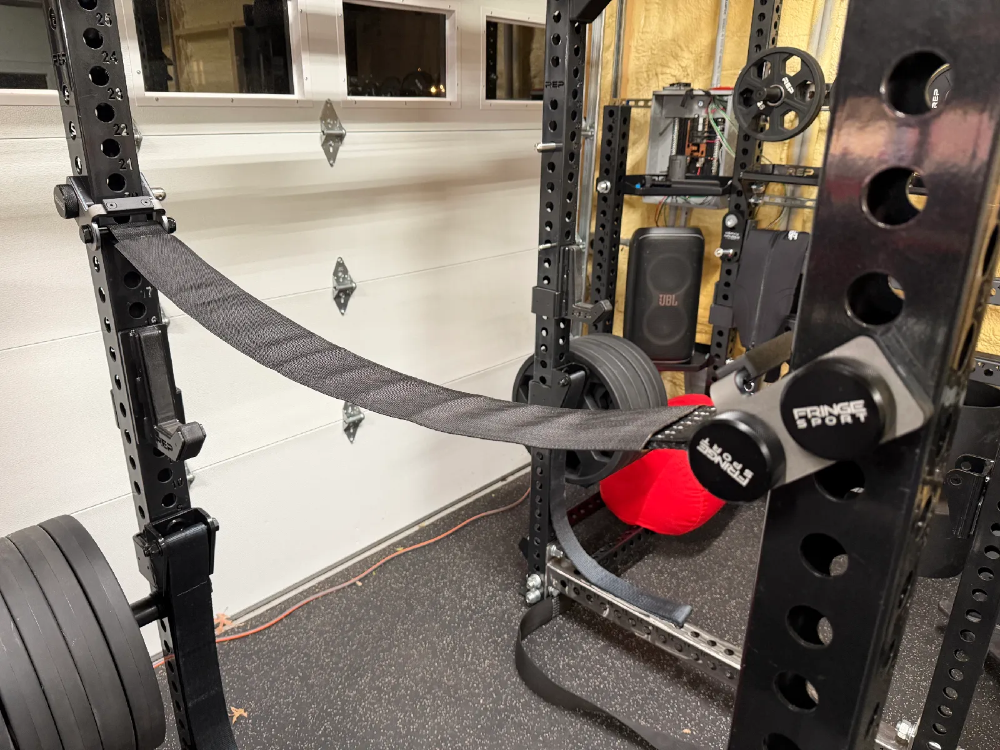
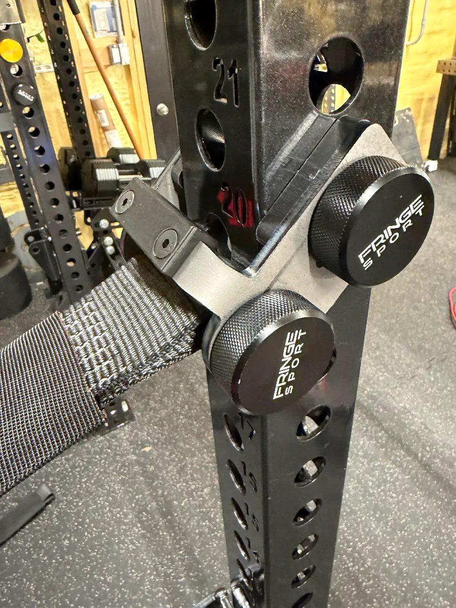

# MagStrap Quick Adjust Strap Safety System

This build provides a quick adjust strap safety system using mag pins to mount to your rack upright.

## Parts List

- **MagStrap Brackets**: Order 4 from [sendcutsend.com](https://sendcutsend.com). Use ¼" A36 HRPO steel. For stainless, adjust the bend radius in Fusion to avoid alerts. You can have SendCutSend tap the ¼-20 holes or do it yourself.
- **MagStrap Center Protectors**: 3D print 4.
- **MagStrap Side Protectors**: 3D print 8.
- **Mounting Hardware**: 24x ¼-20 x 5/8" flat head socket cap screws.
- **Straps**: Order from [customtiedowns.com](https://customtiedowns.com). For a Rep (41" rack), use 42" (3.5') straps with protective covers.
  - Straps: Search for `35094`
  - Protectors: Search for `35093`

## Assembly

1. Mount the MagStrap Brackets to the rack upright using mag pins.
2. Attach the Center and Side Protectors to the brackets with the socket cap screws.
3. Install the straps as needed for your rack.

## Notes

- No engineering analysis has been performed. This is a DIY project provided as-is, with no warranty or suitability for purpose implied (see BSD license).
- Use at your own risk.

## Files

- `magstrap-bracket.step` – Laser cut bracket file
- `magstrap-center-protector.3mf` – 3D print file for center protector
- `magstrap-side-protector.3mf` – 3D print file for side protector

## License

BSD License – See [LICENSE](../LICENSE) for details.
