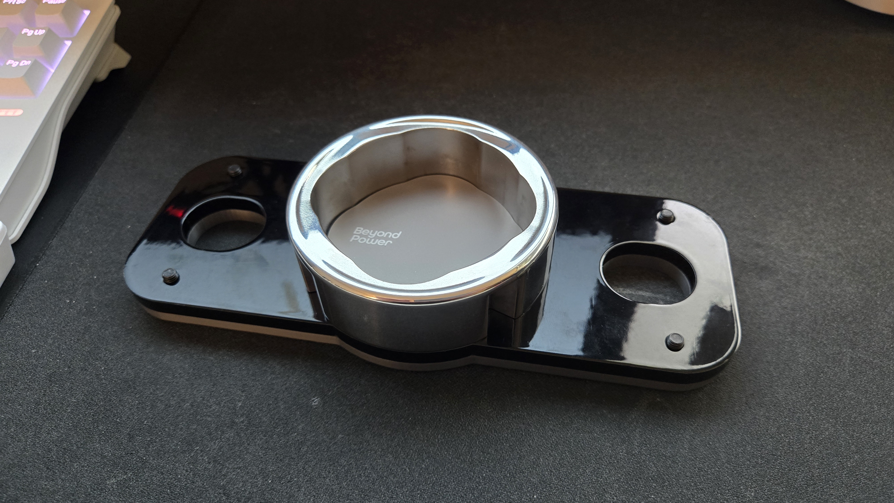
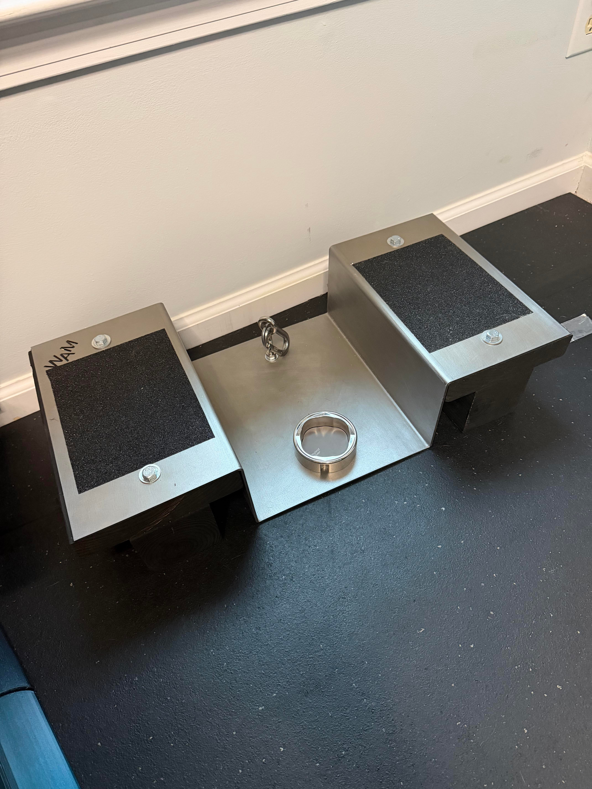
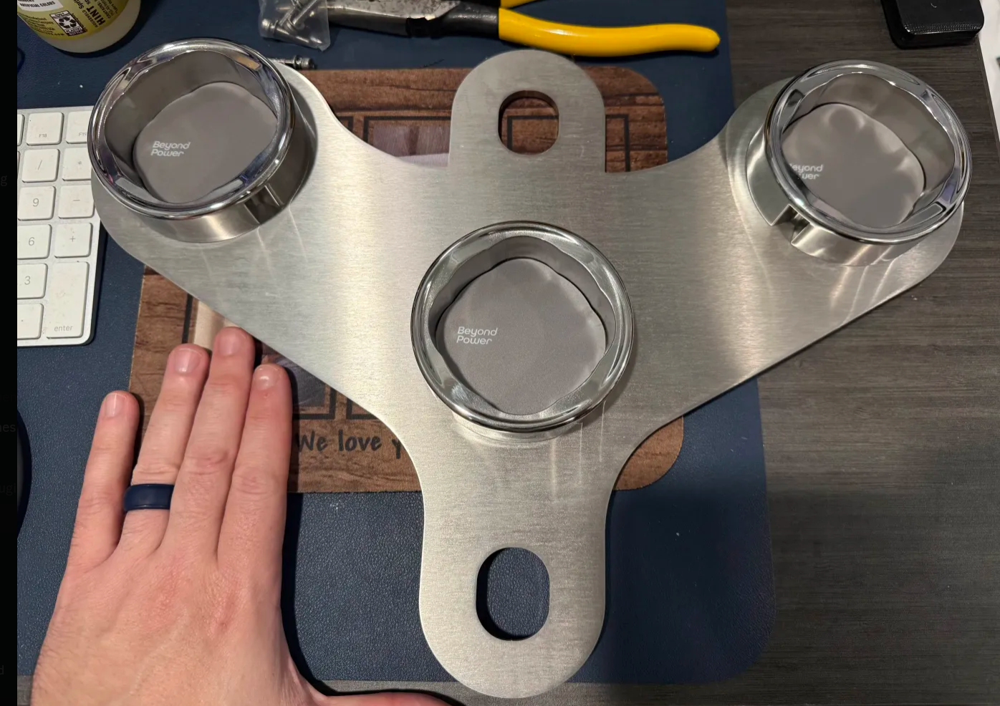
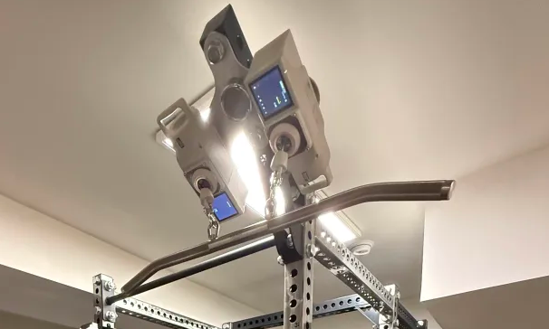
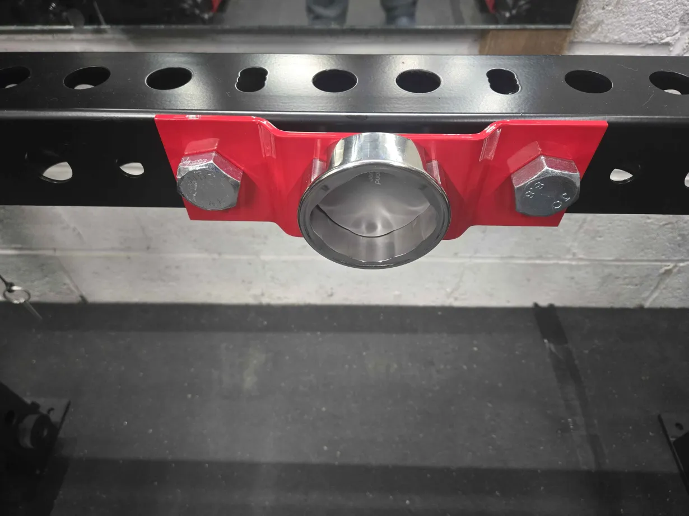
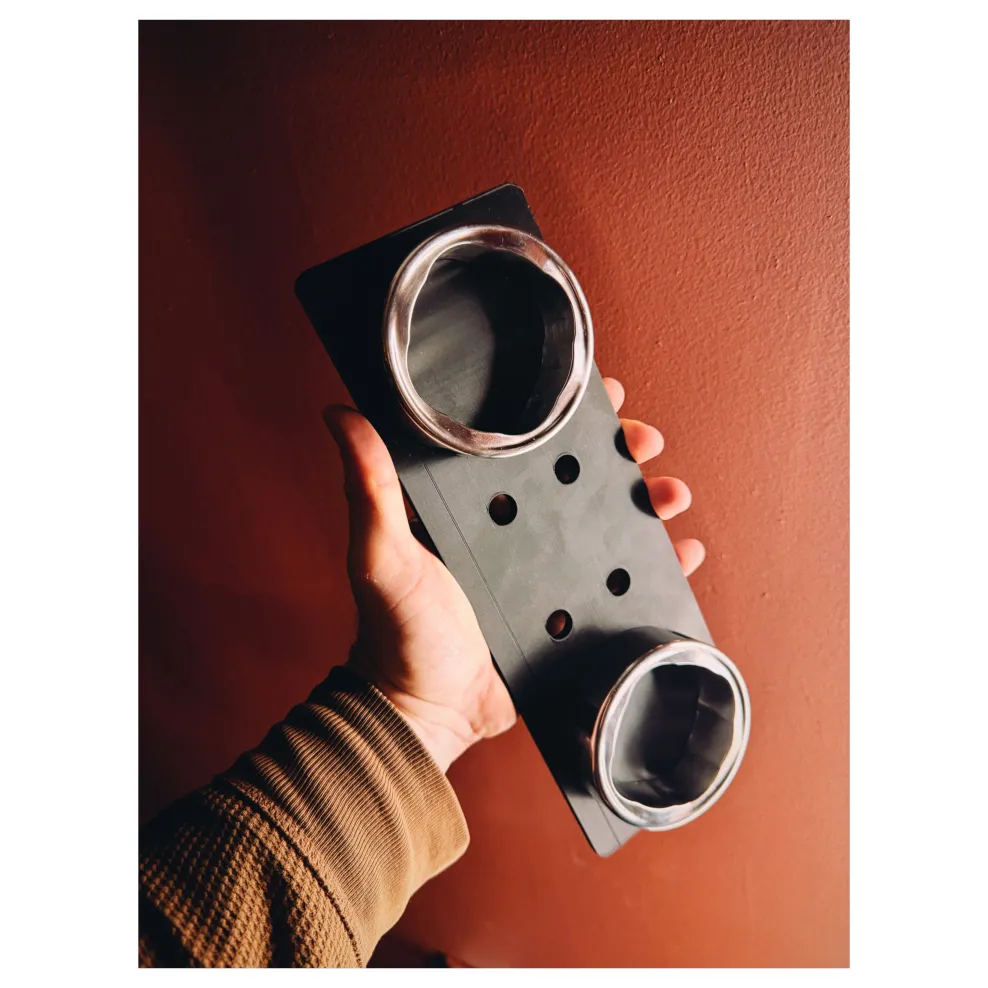
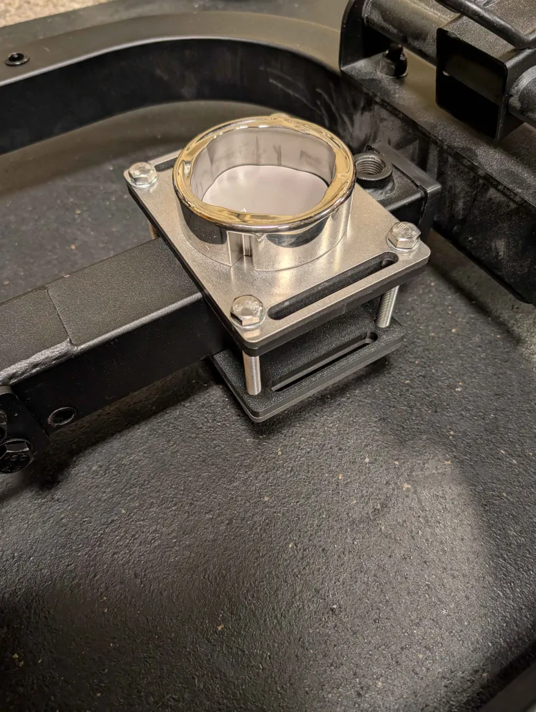

Custom mounting solutions for Voltra cable attachments.

## Table of Contents

- [Table of Contents](#table-of-contents)
- [Tranman – Low Profile Fixed Mount](#tranman--low-profile-fixed-mount)
  - [📁 Files](#-files)
  - [🔧 Specifications](#-specifications)
  - [💰 Cost Reference](#-cost-reference)
  - [⚠️ Notes](#️-notes)
  - [📝 Credits](#-credits)
- [wamoore911 – Belt Squat Stand Mount](#wamoore911--belt-squat-stand-mount)
  - [📁 Files](#-files-1)
  - [🔧 Specifications](#-specifications-1)
  - [💡 Build Notes](#-build-notes)
  - [📝 Credits](#-credits-1)
- [Dr Tatty Waffles – Triple Voltra Bracket](#dr-tatty-waffles--triple-voltra-bracket)
  - [📁 Files](#-files-2)
  - [📝 Notes](#-notes)
  - [📝 Credits](#-credits-2)
- [Ryan – Fixed Voltra Mount](#ryan--fixed-voltra-mount)
  - [📁 Files](#-files-3)
  - [🔧 Specifications](#-specifications-2)
  - [💰 Cost Reference](#-cost-reference-1)
  - [📝 Notes](#-notes-1)
  - [📝 Credits](#-credits-3)
- [Salt - SquatMax Voltra Mount](#salt---squatmax-voltra-mount)
  - [📁 Files](#-files-4)
  - [🔧 Specifications](#-specifications-3)
  - [📝 Credits](#-credits-4)
- [Ryan \& Carter - Bolt together strap Voltra mount](#ryan--carter---bolt-together-strap-voltra-mount)
  - [📁 Files](#-files-5)
  - [🔧 Specifications](#-specifications-4)
  - [📝 Credits](#-credits-5)

---

## Tranman – Low Profile Fixed Mount

### 📁 Files

- [Mount STEP](tranman/Low%20Profile%20Fixed%20Mount%20VF.step)
- [3D print shim](tranman/Low%20Profile%20Fixed%20Mount%20-%20Shim%20VF.3mf)
- [Shim on Makerworld](https://makerworld.com/en/models/2019445-low-profile-fixed-voltra-mount-shim#profileId-2176122)

### 🔧 Specifications

- 304 stainless steel, 0.187" thickness
- Mounting hardware: M5 × 0.8 countersunk hex bolts
- Requires printed shim to match the Voltra housing taper

### 💰 Cost Reference

- SendCutSend quote: $54.70 for two mounts + shipping

### ⚠️ Notes

- Voltra can only be mounted in a single orientation because of bolt spacing
- Dry fit with the shim before tightening to avoid twisting the pulley body

### 📝 Credits

Design by Tranman

---

## wamoore911 – Belt Squat Stand Mount

### 📁 Files

- [Squat stand DXF](wamoore911/SQUATSTAND3.dxf)
- [Build thread](https://old.reddit.com/r/BeyondPower/comments/1nmpn8i/easy_diy_belt_squat_base/) on r/BeyondPower

### 🔧 Specifications

- Base: 2×6 and 4×4 lumber construction
- Mounting plate: SendCutSend steel plate (spec in DXF)
- Finish: Powder coat recommended; clear over polished steel rusts quickly

### 💡 Build Notes

- Plate is rotated slightly so the pulley centers over the platform
- Add clearance on the floor side to accommodate Voltra screw heads
- Powder coat or paint immediately after polishing to avoid flash rust

### 📝 Credits

Design by wamoore911

---

## Dr Tatty Waffles – Triple Voltra Bracket

 courtesy of RSmiley111

### 📁 Files

- [Triple-mount DXF](DrTattyWaffles/triple-mount.dxf)

### 📝 Notes

- Holds three Voltra units simultaneously for fast attachment swaps
- Ideal for pairing high/low pulleys with a central neutral handle
- 4.7 mm stainless steel

### 📝 Credits

Design by Dr Tatty Waffles

---

## Ryan – Fixed Voltra Mount

### 📁 Files

- [Fixed mount STEP](markofzen/voltra_mount_standard_5_holes.step)

### 🔧 Specifications

- 4.8 mm steel plate (0.189")
- All bends: 50° angles

### 💰 Cost Reference

- SendCutSend quote: $77.75 for two including bending + shipping

### 📝 Notes

- Raised mount location to allow multiple mounting configurations
- When ordering from SendCutSend, specify 50° for all bends
- Might be able to use thinner metal than 4.8 mm

### 📝 Credits

Design by Ryan

---

## Salt - SquatMax Voltra Mount

### 📁 Files

- [Squatmax-Mount STEP](Salt/Salt%20mount%20Vertical.step)

### 🔧 Specifications

- SendCutSend requires 1/4" thickness

### 📝 Credits

Design by Salt

## Ryan & Carter - Bolt together strap Voltra mount

### 📁 Files

- [3D printed pad STEP](markofzen/voltra-strap-mount-3d%20printed-pad-v2.step)
- [SendCutSend metal plate STEP](markofzen/voltra-strap-mount-metal-v2.step)

### 🔧 Specifications

- 4.7 mm steel plate in SendCutSend (SCS) (Stainless is fine, but recommend tumble/deburring)
- 10 mm bolts for each corner
- M8 flange bolts for padding threaded to backplate

### 📝 Credits

Design by Ryan & Carter